# Learn Playwright Batch 2X

<div align="center">


**Structured learning resource for mastering JavaScript fundamentals and Playwright automation testing**

*Zero to automation hero — JavaScript basics → Advanced JS → TypeScript → Playwright*

[Quick Start](#-quick-start) · [Curriculum](#-curriculum-roadmap) · [Chapters](#-chapters-overview) · [What You'll Build](#-what-youll-build)

</div>

---

## Welcome to Batch 2X

This repository is your **chapter-by-chapter course companion** for learning JavaScript from the ground up and progressing toward Playwright automation testing. Code shown in lectures lands here so you can read it, run it, and practice on it.

> Content gets added **as we progress through the batch** — so check back after every class.

### What you'll learn

- **JavaScript Fundamentals** — variables, identifiers, literals, operators, control flow
- **Advanced JavaScript** — functions, arrays, objects, callbacks, promises, async/await, OOP
- **TypeScript** — types, interfaces, enums, generics
- **Playwright** — setup, locators, assertions, fixtures, POM, debugging, CI

---

## 🗺️ Curriculum Roadmap

```mermaid
graph TB
    subgraph root["LearnPlaywrightBatch2X"]
        direction TB

        subgraph js["📘 JavaScript Fundamentals"]
            ch1["Ch 1: Basics ✅"]
            ch2["Ch 2: JS Concepts ✅"]
            ch3["Ch 3: Identifiers & Literals ✅"]
            ch4["Ch 4: var / let / const & Hoisting ✅"]
            ch5["Ch 5: Literals ✅"]
            ch6["Ch 6: Operators ✅"]
            ch7["Ch 7: If / Else ✅"]
            ch8["Ch 8: Switch ✅"]
            ch9["Ch 9: User Input ✅"]
            ch10["Ch 10: Loops ✅"]
            ch11["Ch 11: Arrays ✅"]
            ch12["Ch 12: Functions & Strings ✅"]
        end

        subgraph adv["⚙️ Advanced JS"]
            adv1["Ch 13: Objects"]
            adv2["Ch 13: 2D Arrays"]
            adv3["Ch 14: Callbacks"]
            adv4["Ch 15: Promises"]
            adv5["Ch 16: Async / Await"]
            adv6["Ch 17: OOP - Classes"]
            adv7["Ch 18: Inheritance"]
        end

        subgraph ts["🟦 TypeScript"]
            ts1["Ch 19: TS Fundamentals"]
            ts2["Ch 20: Interfaces"]
            ts3["Ch 21: Enums"]
            ts4["Ch 22: Generics"]
        end

        subgraph pw["🎭 Playwright"]
            pw1["Ch 23: PW Fundamentals"]
            pw2["Ch 24: Locators & Assertions"]
            pw3["Ch 25: Fixtures & POM"]
            pw4["Ch 26: Debugging & CI"]
        end

        subgraph extras["🎯 Bonus"]
            tasks["Interview Coding Questions"]
            tests["Real-world Test Projects"]
        end
    end

    js --> adv --> ts --> pw --> extras

    style js fill:#e1f5fe,stroke:#01579b
    style adv fill:#fff3e0,stroke:#e65100
    style ts fill:#e0f7fa,stroke:#00838f
    style pw fill:#f3e5f5,stroke:#7b1fa2
    style extras fill:#e8f5e9,stroke:#2e7d32
```

---

## 📚 Current Folder Structure

```
LearnPlaywrightBatch2X/
├── chapter_01_Basics/                  ✅ Hello World, env setup, hot code
│   ├── 01_Basics.js                    # First console.log program
│   ├── 02_JS.js                        # Variables & a simple loop
│   ├── 03_JS_Verify_Setup.js           # Verify Node.js/OS/arch
│   └── 04_HotCode.js                   # JIT & "hot" code paths
│
├── chapter_02_JavaScript_Concepts/     ✅ JS Basics
│   └── 05_JS_Basics.js                 # Variables & console output
│
├── chapter_3_Identifier_Literals/     ✅ Identifiers, literals & comments
│   ├── 06_Identifier_Rules.js          # Valid identifier names
│   ├── 07_Identifier_Part2.js          # Naming conventions
│   ├── 08_Comments.js                  # Single-line & multi-line comments
│   ├── js_identifier_rules.js          # Identifier rules reference
│   ├── VS_Code_KeyBoard_Mac_Short_cuts.md     # macOS VS Code shortcuts
│   └── VS_Code_KeyBoard_Windows_Short_cuts.md # Windows VS Code shortcuts
│
├── chapter_4_JavaScript_Concepts/     ✅ var / let / const, hoisting & TDZ
│   ├── 09_var_let_const.js             # var, let, const basics
│   ├── 10_functions.js                 # Function declaration & calls
│   ├── 11_var_explained.js             # var deep dive
│   ├── 12_let_peope_love.js            # let deep dive
│   ├── 13_const_explained.js           # const deep dive
│   ├── 14_var_functionscope.js         # var function scope
│   ├── 15_let_scope.js                 # let block scope
│   ├── 16_Hoisting.js                  # Variable hoisting explained
│   ├── 17_hoisting_fn.js               # Function hoisting
│   ├── 18_let_hoisting.js              # let hoisting & Temporal Dead Zone (TDZ)
│   ├── 19_let_hoisting_block.js        # Block-scoped TDZ shadowing
│   ├── 20_let_const.js                 # const hoisting (TDZ for const)
│   └── 21_Jr_QA.js                     # Interview Q&A — TDZ trap with const
│
├── chapter_05_Literal/                 ✅ Literals — null, numbers, strings, template
│   ├── 22_Literal.js                   # Literal kinds + typeof
│   ├── 23_null_undefined.js            # null vs undefined deep dive
│   ├── 24_null.js                      # Empty values — null, undefined, "", 0
│   ├── 25_Literal_All.js               # All literal forms at a glance
│   ├── 26_Literal_Number_all.js        # Number literals — decimal, binary, octal, hex, BigInt
│   ├── 27_String.js                    # Single vs double quotes
│   ├── 28_Template_Literal.js          # Backticks — interpolation in selectors/logs
│   └── 29_Backtick_single_double.js    # ' vs " vs ` — the one-page summary
│
├── chapter_06_double_triple_equal/     ✅ Operators — arithmetic, comparison, logical
│   ├── 30_Operator.js                  # Assignment operator =
│   ├── 31_Arithmetic_OP.js             # + - * /
│   ├── 32_Modulus_OP.js                # % — odd/even trick
│   ├── 33_Expo_OP.js                   # ** exponentiation
│   ├── 34_IQ.js                        # Compound assignment: += -= *= /= %=
│   ├── 35_Comparsion_OP.js             # > < >= <= == === != !==
│   ├── 36_Comparsion_Strict_loose.js   # Loose vs strict — number == string traps
│   ├── 37_IQ_Loose_Strict.js           # Interview quick-fire: 0 == "" == "0"
│   ├── 38_Confusing_Comparsion.js      # 🔥 == vs === full reference
│   ├── 39_Logical_Op.js                # && || !
│   ├── 40_String_Con_Op.js             # + on strings = concatenation
│   ├── 41_Ternary_Op.js                # a ? b : ternary operator
│   ├── 42_Type_Op.js                   # typeof operator
│   ├── 43_Incre_Decre_Op.js            # ++ -- pre/post increment/decrement
│   ├── 44_Null_Op.js                   # ?? nullish coalescing operator
│   ├── 45_Post_Increment.js            # Post-increment vs pre-increment deep dive
│   ├── 46_IQ_INCREMENT_D.js            # Increment/decrement interview questions
│   └── 47_Advance_ID_.js               # Advanced identifier & operator patterns
│
├── chapter_07_If_else/                 ✅ If / Else — control flow decisions
│   ├── 48_IF_ESLE.js                   # Basic if / else syntax
│   ├── 49_If_elseif_else.js            # if / else if / else ladder
│   ├── 50_REAL_IF_ELSE.js              # Real-world if/else examples
│   ├── 51_API_IF_ELSE.js               # API response handling with if/else
│   ├── 52_IQ_IF_ELSE.js                # If/else interview questions
│   ├── 53_IF_ELSE_real.js              # More real-world conditional patterns
│   ├── 54_IQ.js                        # Interview quick-fire: conditionals
│   ├── 55_IE.js                        # Internet Explorer compatibility patterns
│   ├── 56_IQ_EVEN_ODD.js               # Even/odd check using modulus
│   ├── 57_Grade_Calc.js                # Grade calculator (if-else-if ladder)
│   ├── 58_LEAP_YEAR.js                 # Leap year logic with nested conditions
│   └── If_Else_Test.js                 # Practice test file
│
├── chapter_08_Switch_Statement/        ✅ Switch — multi-way branching
│   ├── 59_Switch.js                    # Basic switch statement syntax
│   ├── 60_No_Break.js                  # Fall-through behavior without break
│   ├── 61_Default.js                   # Default case handling
│   ├── 62_REAL_TIME_EXAMPLE.js         # Real-world switch examples
│   ├── 63_Switch_Group.js              # Grouping multiple cases
│   ├── 64_IQ.js                        # Switch interview questions
│   ├── 65_IQ2.js                       # More switch Q&A
│   ├── 66_IQ3.js                       # Switch edge cases
│   └── 67_IQ4.js                       # Advanced switch patterns
│
├── chapter_09_UserInput/               ✅ User Input — reading from CLI
│   ├── 68_User_Input.js                # Browser prompt-based input
│   ├── 69_Node_readline.js             # Node.js readline module
│   ├── 70_prompt_sync.js               # Synchronous prompt input
│   └── test.js                         # Input handling test file
│
├── chapter_10_Loops/                   ✅ Loops — for, while, do-while
│   ├── 71_For_loop.js                  # Why loops exist — repeating code
│   ├── 72_For_loop.js                  # Basic for loop syntax
│   ├── 73_For_Loop2.js                 # for loop with different bounds
│   ├── 74_IQ.js                        # for loop edge cases & IQ
│   ├── 75_For_OF_IN_EACH.js            # while loop intro (for...of/in later)
│   ├── 76_While.js                     # while loop — condition before entry
│   ├── 77_Do_While.js                  # do-while — execute at least once
│   ├── 78_Do_While.js                  # do-while retry pattern
│   ├── 79_IQ.js                        # while loop countdown IQ
│   ├── 80_IQ.js                        # do-while edge case IQ
│   ├── 81_IQ.js                        # Loop interview questions
│   ├── 82_IQ.js                        # Advanced loop IQ
│   └── Test.js                         # Loop practice test file
│
├── chapter_11_Arrays/                  ✅ Arrays — create, access, search, transform
│   ├── 83_Arrays.js                    # Array basics — empty, literal, mixed types
│   ├── 84_Arrays.js                    # Creating arrays (constructor, Array.of, Array.from)
│   ├── 85_Access_Array.js              # Access & modify elements, .at() with negatives
│   ├── 86_Arrays_Adding_Remove.js      # push, pop, unshift, shift
│   ├── 87_Adding_Remove2.js             # splice — delete, add, replace
│   ├── 88_REAL_Example.js             # Real-world browser array example
│   ├── 89_Searching.js                # indexOf, lastIndexOf, includes, find, findIndex
│   ├── 90_Iterate.js                  # for, for...of, forEach, for...in, .entries()
│   ├── 91_Transform_Array.js          # map, filter, reduce, flat
│   ├── 92_Arrays.js                   # sort — default vs custom comparator
│   ├── 93_Array_Slicing.js            # slice vs splice
│   ├── 94_Concat_array.js             # concat, spread ..., join
│   └── 95_Array_Checking.js           # Array.isArray, every, some
│
├── chapter_12_Functions/               ✅ Functions — declarations, expressions, arrow, scope, closures
│   ├── 96_Functions.js                 # Function definition & call basics
│   ├── 97_Type1_Fn_Basic_Functions.js  # Type 1: no param, no return
│   ├── 98_Type2_Fn_With_Param_No_Return.js  # Type 2: with param, no return
│   ├── 99_Type3_Fn_without_Param_Return_Type.js  # Type 3: no param, with return
│   ├── 100_Type4_Fn_With_Param_With_Return.js    # Type 4: with param, with return
│   ├── 101_Template_literal.js         # Template literals inside functions
│   ├── 102_Fn_Expression.js            # Function expressions
│   ├── 103_Arrow_Fn.js               # Arrow functions (ES6)
│   ├── 104_Arrow_Fn_REAL.js          # Real-world arrow function examples (API validation)
│   ├── 105_IIFE.js                   # Immediately Invoked Function Expressions
│   ├── 106_Default_Param_Fn.js       # Default parameters in functions
│   ├── 107_IQ.js                     # Function interview questions
│   ├── 108_Rest_Param_Fn.js          # Rest parameters (...args)
│   ├── 109_IQ.js                     # Return values & hoisting traps
│   ├── 110_Spead_IQ.js               # Spread operator with functions
│   ├── 111_Scope._Fn.js              # Global vs local scope in functions
│   ├── 112_IQ.js                     # Nested scope & closure basics
│   ├── 113_Closure.js                # Closure fundamentals
│   ├── 114_Closure.js                # Closure counter pattern
│   ├── 115_API_REAL_Closure.js       # Real-world closure: retry tracker
│   ├── 116_Higher_Order_Fn.js        # Higher-order functions
│   └── 117_Pure_Fn.js                # Pure vs impure functions
│
└── README.md                           👋 You are here
```

> **Legend:** ✅ Done · 🚧 Coming soon

---

## 🚀 Quick Start

### Prerequisites

| Tool | Version | Purpose |
|------|---------|---------|
| **Node.js** | 18+ (LTS recommended) | Runs all `.js` files |
| **npm** | Bundled with Node | Package manager |
| **VS Code** | Latest | Recommended editor |
| **Git** | Latest | Clone the repo |

### Setup

```bash
# 1. Clone the repository
git clone https://github.com/azherkhan0215-qa/LearnPlayWrightBatch2X.git
cd LearnPlayWrightBatch2X

# 2. Verify your setup
node chapter_01_Basics/03_JS_Verify_Setup.js

# 3. Run your first JS program
node chapter_01_Basics/01_Basics.js
```

### Verify it works

```bash
$ node chapter_01_Basics/01_Basics.js
Hello World
```

If you see that line, you're all set! 🎉

---

## 📅 Weekly Plan


| Week | Topic | Chapters | Outcome |
|:----:|-------|---------:|---------|
| 1 | JS Basics & Setup | Ch 1 | Run Node, write first JS |
| 2 | Variables & Hoisting | Ch 2–4 | Master `var`/`let`/`const` |
| 3 | Identifiers, Literals, Operators | Ch 3–6 | Read/write any expression |
| 4 | Control Flow | Ch 7–9 | If/else, switch, loops |
| 5 | Arrays & Functions | Ch 11–12 | Manipulate data confidently |
| 6 | Objects & Advanced | Ch 12–13 | Use JS data structures |
| 7 | Async (Callbacks → Promises) | Ch 14–15 | Handle async work |
| 8 | Async/Await + OOP | Ch 16–18 | Modern async, classes |
| 9 | TypeScript | Ch 19–22 | Type-safe automation code |
| 10–12 | Playwright | Ch 23–26 | First passing test, POM, CI |

---

## 🧭 Learning Flow

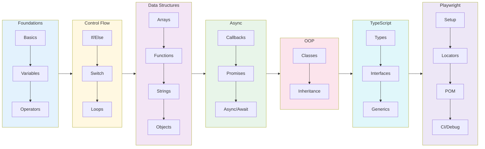

---

## 📖 What's in Chapter 1 (Available Now)

### Files

| File | Topic | What you'll learn |
|------|-------|-------------------|
| `01_Basics.js` | Hello World | First `console.log`, declaring a variable |
| `02_JS.js` | Variables & Loops | Re-declaring with `let`, calling functions inside loops |
| `03_JS_Verify_Setup.js` | Environment Check | `process.platform`, `process.arch`, `process.version` |
| `04_HotCode.js` | Hot Code Paths | How V8 optimizes frequently-called functions |

### Key Concepts

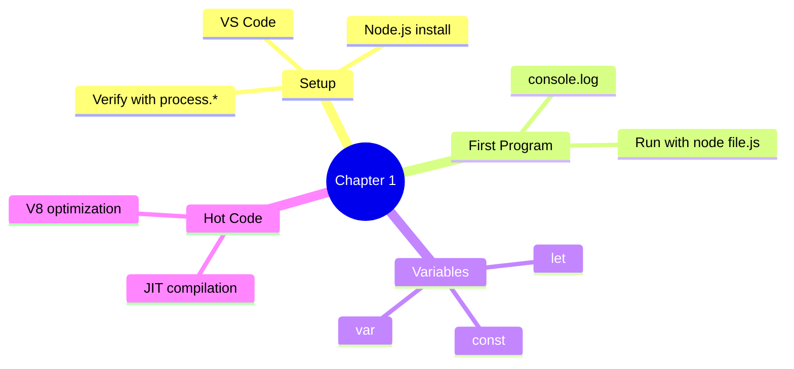

### Run them

```bash
node chapter_01_Basics/01_Basics.js          # → "Hello World"
node chapter_01_Basics/02_JS.js              # → counts to 100000 calling print()
node chapter_01_Basics/03_JS_Verify_Setup.js # → prints platform / arch / node version
node chapter_01_Basics/04_HotCode.js         # → triggers V8 hot-path optimization
```

---

## 📖 What's in Chapter 2 (Available Now)

### Files

| File | Topic | What you'll learn |
|------|-------|-------------------|
| `05_JS_Basics.js` | JS Basics | Variables, assignment, console output |

---

## 📖 What's in Chapter 3 (Available Now)

### Files

| File | Topic | What you'll learn |
|------|-------|-------------------|
| `06_Identifier_Rules.js` | Identifier Rules | Valid names (`$`, `_`, camelCase) |
| `07_Identifier_Part2.js` | Naming Conventions | camelCase, PascalCase, snake_case |
| `08_Comments.js` | Comments | Single-line, multi-line & JSDoc style |
| `js_identifier_rules.js` | Reference | Quick identifier rules cheat-sheet |
| `VS_Code_KeyBoard_Mac_Short_cuts.md` | Shortcuts | VS Code keyboard shortcuts for macOS |
| `VS_Code_KeyBoard_Windows_Short_cuts.md` | Shortcuts | VS Code keyboard shortcuts for Windows |

### Key Concepts

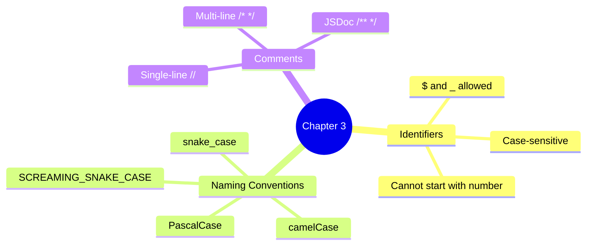

---

## 📖 What's in Chapter 4 (Available Now)

### Files

| File | Topic | What you'll learn |
|------|-------|-------------------|
| `09_var_let_const.js` | var, let, const | Declaration, re-declaration, reassignment |
| `10_functions.js` | Functions | Declaring and calling functions |
| `11_var_explained.js` | var Deep Dive | How `var` works in loops & functions |
| `12_let_peope_love.js` | let Deep Dive | Block-scoped `let` behavior |
| `13_const_explained.js` | const Deep Dive | Immutable bindings with `const` |
| `14_var_functionscope.js` | Function Scope | `var` scoped to functions |
| `15_let_scope.js` | Block Scope | `let` scoped to blocks `{}` |
| `16_Hoisting.js` | Hoisting | Variable hoisting & `undefined` |
| `17_hoisting_fn.js` | Function Hoisting | How function declarations are hoisted |
| `18_let_hoisting.js` | let TDZ | Temporal Dead Zone — why `let` errors before declaration |
| `19_let_hoisting_block.js` | Block TDZ | Inner-block `let` does **not** inherit outer value |
| `20_let_const.js` | const Hoisting | `const` is hoisted too — same TDZ rules apply |
| `21_Jr_QA.js` | Interview Q&A | Classic TDZ trap with `const` (junior SDET quiz) |

### Key Concepts

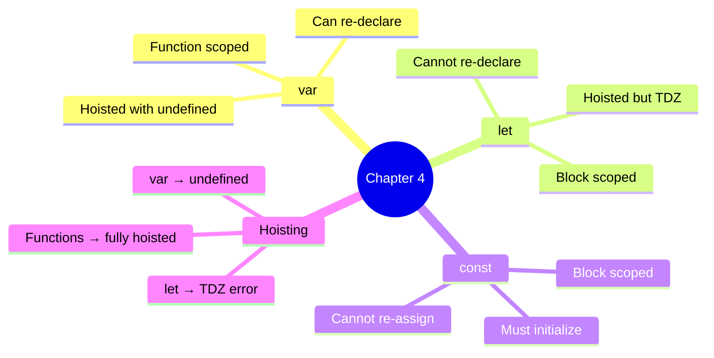

### Run them

```bash
node chapter_4_JavaScript_Concepts/09_var_let_const.js  # → var, let, const behavior
node chapter_4_JavaScript_Concepts/16_Hoisting.js       # → see hoisting in action
node chapter_4_JavaScript_Concepts/18_let_hoisting.js   # → throws TDZ ReferenceError
node chapter_4_JavaScript_Concepts/21_Jr_QA.js          # → interview-style TDZ trap
```

### 18 — Temporal Dead Zone (TDZ)

**Concept:** TDZ is the window between when a `let`/`const` is hoisted to the top of its block and when its declaration line is actually reached. Inside that window any read or write throws `ReferenceError: Cannot access 'x' before initialization`.

**Why:** Catches use-before-declare bugs at the source — unlike `var`, which silently returns `undefined` and hides the bug until runtime.

**Q&A — why use this?**
- **Q: Are `let` and `const` really hoisted?** A: Yes — but to a "not yet usable" state. The binding exists; the value does not. That gap is the TDZ.
- **Q: How is this different from `var`?** A: `var` is hoisted **and** initialized to `undefined` immediately. `let`/`const` are hoisted but uninitialized — touching them = ReferenceError.
- **Q: Why does the interview question with `const c` throw?** A: The `console.log(c)` runs **inside** the TDZ of `const c = "Azhar"`. Hoisting is not "no declaration"; it's "declaration parked, value not yet set".

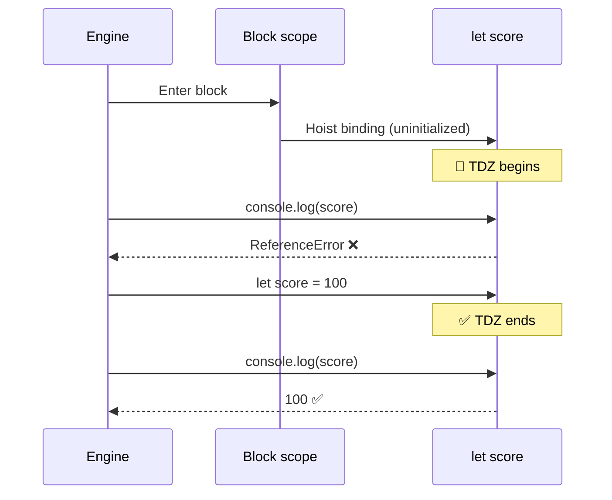

```js
// 18_let_hoisting.js — TDZ in action
console.log(score); // ❌ ReferenceError: Cannot access 'score' before initialization
let score = 100;

{
    // ---- TDZ for inner "score" starts ----
    // console.log(score);  // ❌ ReferenceError
    // typeof score;        // ❌ ReferenceError (!! typeof normally never throws)
    let score = 100;        // ✅ TDZ ends here
    console.log(score);     // 100
}
```

| Trap | `var` | `let` / `const` |
|:-----|:-----:|:---------------:|
| Read before declaration | `undefined` | **ReferenceError** |
| Re-declare in same scope | ✅ allowed | ❌ SyntaxError |
| Scope | Function | Block `{}` |
| Hoisted? | ✅ + initialized | ✅ but in TDZ |

---

## 📖 What's in Chapter 5 — Literals (Available Now)

### Files

| File | Topic | What you'll learn |
|------|-------|-------------------|
| `22_Literal.js` | Literals + `typeof` | String, number, boolean, null, undefined literals |
| `23_null_undefined.js` | null vs undefined | Who sets them, when to use which, the `typeof null === 'object'` quirk |
| `24_null.js` | Empty values | `null`, `undefined`, `""`, `0` — same role, different types |
| `25_Literal_All.js` | All literals | Whirlwind tour of every literal form |
| `26_Literal_Number_all.js` | Number literals | Decimal, binary `0b`, octal `0o`, hex `0x`, BigInt `n`, `1e6`, `1_000_000`, `NaN`, `Infinity` |
| `27_String.js` | Quotes | Single `'…'` vs double `"…'` strings (interchangeable) |
| `28_Template_Literal.js` | Backticks | `` `${var}` `` interpolation — Playwright selectors, log lines, screenshot paths |
| `29_Backtick_single_double.js` | `'` vs `"` vs `` ` `` | One-page comparison + migration from `+`-concatenation |

### Key Concepts

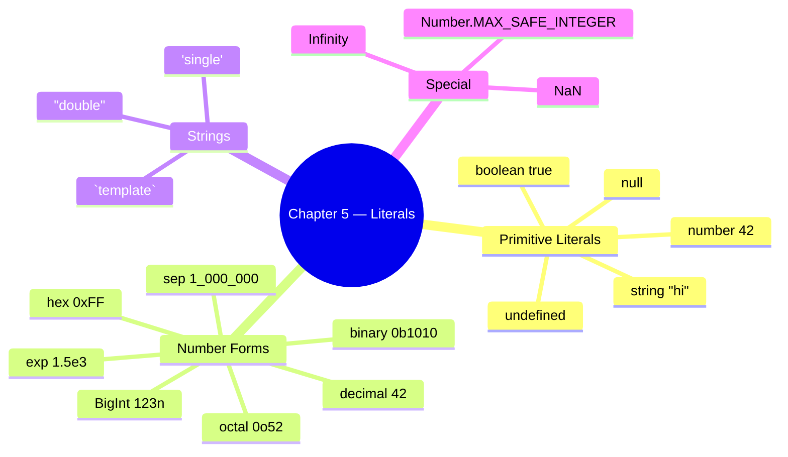

### Run them

```bash
node chapter_05_Literal/22_Literal.js              # → typeof for each literal
node chapter_05_Literal/23_null_undefined.js       # → null vs undefined walkthrough
node chapter_05_Literal/26_Literal_Number_all.js   # → every number literal form
node chapter_05_Literal/28_Template_Literal.js     # → backtick interpolation
```

---

### 22 — What is a Literal?

**Concept:** A *literal* is a value written **directly** in source code — `42`, `"hello"`, `true`, `null`. It's the raw value, not a variable referring to one.

**Why:** Every value in a JS program either comes from a literal you typed or was derived from one. Knowing the literal forms = knowing the JS type system.

**Q&A — why use this?**
- **Q: Why does `typeof null` return `"object"`?** A: 26-year-old JavaScript bug — preserved for backwards compatibility. Test against `null` with `value === null`, never `typeof`.
- **Q: Is `undefined` a literal?** A: Practically yes, but it's actually a property of the global object. Never assign `undefined` manually — let JS produce it.
- **Q: Why does `typeof` on a never-declared variable not throw?** A: `typeof` is the **only** operator that's TDZ-safe for *undeclared* identifiers. Returns `"undefined"`. (But TDZ for `let`/`const`? Still throws — see Ch 4.)

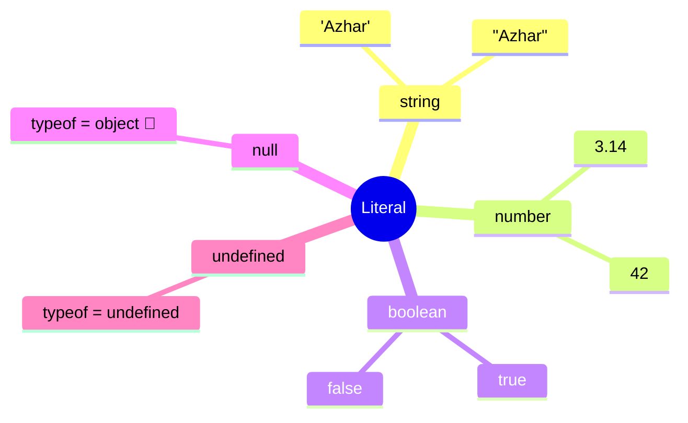

```js
// 22_Literal.js
let age = "Azhar";        // string literal
let isStudent = true;      // boolean literal
let pi = 3.14;             // number literal
let nullValue = null;      // null literal
let undefinedValue;        // implicitly undefined

console.log(typeof age);            // "string"
console.log(typeof pi);             // "number"
console.log(typeof isStudent);      // "boolean"
console.log(typeof nullValue);      // "object"   ← JS bug, kept forever
console.log(typeof undefinedValue); // "undefined"
```

---

### 23 — null vs undefined

**Concept:** Both mean "no value", but: `undefined` = JS set it (uninitialized, missing return); `null` = developer set it on purpose ("explicitly empty").

**Why:** Mixing them up causes 90% of "Cannot read properties of undefined" bugs in test code — knowing which to expect tells you whether the bug is in your code or the SUT.

**Q&A — why use this?**
- **Q: When should *I* assign `null`?** A: When you want to deliberately **clear** a reference (`user = null`) or signal "intentionally empty". Never reach for `undefined` — let JS produce it.
- **Q: `null == undefined` → ?** A: `true` with `==`, `false` with `===`. Always use `===` to keep them distinct in test assertions.
- **Q: Playwright API returns null — what does that mean?** A: "Element/value asked for does not exist." Returns `undefined` → "API wasn't called" or "property missing". Different bug categories.

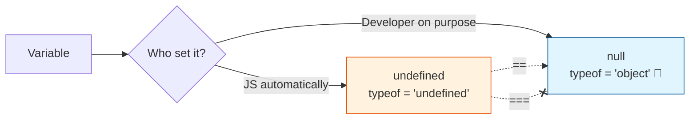

```js
// 23_null_undefined.js
let userName;                         // JS sets it
console.log(userName);                // undefined
console.log(typeof userName);         // "undefined"

let profilePicture = null;            // developer sets it
console.log(profilePicture);          // null
console.log(typeof profilePicture);   // "object"  ← classic JS quirk

let a;
let b = null;
console.log(a == b);   // true  ← loose equality
console.log(a === b);  // false ← strict equality (different types)
```

| | `undefined` | `null` |
|:-:|:-:|:-:|
| Set by | JavaScript | Developer |
| `typeof` | `"undefined"` | `"object"` (bug) |
| Use case | "Not initialized yet" | "Cleared on purpose" |

---

### 26 — Number Literals (every form)

**Concept:** JS has one `number` type (IEEE-754 double) — but many ways to *write* a number: decimal, binary `0b`, octal `0o`, hex `0x`, exponential `1.5e3`, separators `1_000_000`, and `BigInt` (`123n`) for huge integers.

**Why:** Choosing the right literal form makes code self-documenting — `0xFF` says "byte mask", `0b1010_0001` says "bit flags", `1_000_000` says "one million, not ten thousand".

**Q&A — why use this?**
- **Q: When do I need BigInt?** A: When values exceed `Number.MAX_SAFE_INTEGER` (`2^53 - 1` = `9007199254740991`). Common in timestamps-with-nanoseconds, blockchain IDs, large DB IDs.
- **Q: `0 / 0` returns?** A: `NaN`. And `typeof NaN === "number"` (yes, really). Test with `Number.isNaN(x)` — **not** `x === NaN` (which is always `false`).
- **Q: Why is `0.1 + 0.2 !== 0.3`?** A: IEEE-754 float rounding. Compare with `Math.abs(a - b) < Number.EPSILON` for currency, or store cents as integers.

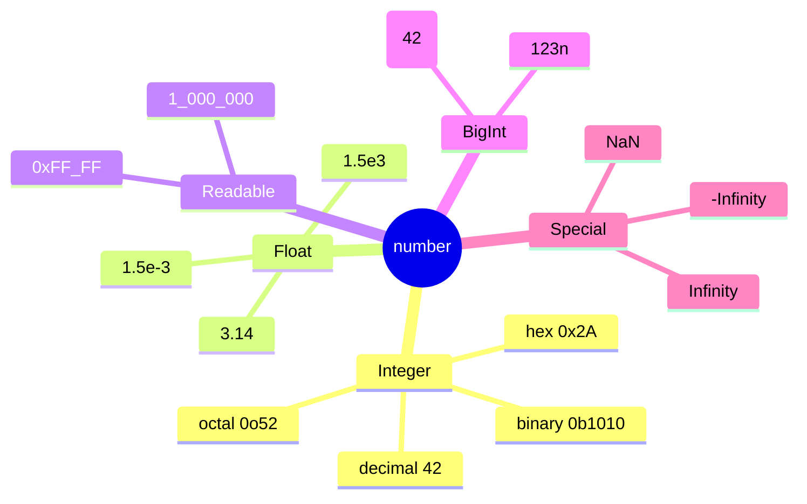

```js
// 26_Literal_Number_all.js
let decimal = 42;
let binary  = 0b1010;          // 10
let octal   = 0o52;            // 42
let hex     = 0x2A;            // 42
let exp     = 1.5e3;           // 1500
let million = 1_000_000;       // 1000000 (ES2021 separator)
let big     = 123456789012345678901234567890n; // BigInt

console.log(1 / 0);                          // Infinity
console.log(0 / 0);                          // NaN
console.log(typeof NaN);                     // "number"
console.log(Number.MAX_SAFE_INTEGER);        // 9007199254740991
```

---

### 28 — Template Literals (Backticks)

**Concept:** A string wrapped in backticks `` ` `` that supports `${expression}` interpolation and real multi-line text — no `+` concatenation, no `\n` escapes.

**Why:** Building Playwright selectors, log lines, dynamic API URLs, and screenshot paths from variables is **everywhere** in test code. Template literals are the cleanest way to do it.

**Q&A — why use this?**
- **Q: When should I prefer backticks over `'…'` / `"…"`?** A: Any string with a variable inside, any multi-line string, any string with an embedded expression. Plain text? Either is fine — be consistent.
- **Q: Can I run code inside `${…}`?** A: Yes — any JS expression: `` `${a + b}` ``, `` `${user.toUpperCase()}` ``, `` `${Date.now()}` ``. Statements (if/for) don't fit, but ternaries do.
- **Q: Do backticks work in JSON?** A: No — JSON only allows `"…"`. Use backticks to **build** the JSON string in JS, then send it.

```mermaid
flowchart LR
    A[rowIndex = 3] --> T["`[data-row=&dollar;{rowIndex}]`"]
    B[columnName = 'email'] --> T
    T --> P[page.locator(…)]
    P --> C[Click cell]
    style T fill:#fff3e0,stroke:#e65100
```

```js
// 28_Template_Literal.js — typical Playwright/test-code use
const rowIndex = 3;
const columnName = "email";
await page.locator(`[data-row="${rowIndex}"] [data-col="${columnName}"]`).click();

const testName = "Login Test";
const status = "FAILED";
const duration = 2.3;
console.log(`[${status}] ${testName} completed in ${duration}s`);

const testCase = "checkout_flow";
const timestamp = Date.now();
await page.screenshot({ path: `screenshots/${testCase}_${timestamp}.png` });
```

| Need | `'…'` / `"…"` | `` `…` `` |
|:-----|:-:|:-:|
| Plain text | ✅ | ✅ |
| `${variable}` interpolation | ❌ | ✅ |
| Multi-line without `\n` | ❌ | ✅ |
| Expression `${a + b}` | ❌ | ✅ |
| JSON-compatible | ✅ | ❌ |

---

## 📖 What's in Chapter 6 — Operators (Available Now)

### Files

| File | Topic | What you'll learn |
|------|-------|-------------------|
| `30_Operator.js` | Assignment | `=` puts the right-hand value into the left-hand binding |
| `31_Arithmetic_OP.js` | Arithmetic | `+`, `-`, `*`, `/` on numbers |
| `32_Modulus_OP.js` | Modulus | `%` remainder — odd/even check (`n % 2 === 0`) |
| `33_Expo_OP.js` | Exponentiation | `**` power (`2 ** 3 === 8`) |
| `34_IQ.js` | Compound | `+=`, `-=`, `*=`, `/=`, `%=` shorthand |
| `35_Comparsion_OP.js` | Comparison | `>`, `<`, `>=`, `<=`, `==`, `===`, `!=`, `!==` → boolean |
| `36_Comparsion_Strict_loose.js` | Loose vs strict | Why `42 == "42"` is `true` but `42 === "42"` is `false` |
| `37_IQ_Loose_Strict.js` | Interview quick-fire | `0 == ""`, `0 == "0"`, `"" == "0"` — transitivity broken |
| `38_Confusing_Comparsion.js` | 🔥 == vs === | NaN, `[]`, `null`/`undefined`, `typeof null`, `[] == ![]` |
| `39_Logical_Op.js` | Logical | `&&`, `\|\|`, `!` on booleans |
| `40_String_Con_Op.js` | String concat | `+` on strings glues them (`"Hi" + " Dev"`) |
| `41_Ternary_Op.js` | Ternary | `a ? b : c` conditional operator |
| `42_Type_Op.js` | Type | `typeof` operator |
| `43_Incre_Decre_Op.js` | Increment/Decrement | `++` and `--` pre/post operators |
| `44_Null_Op.js` | Nullish | `??` nullish coalescing operator |

### Key Concepts

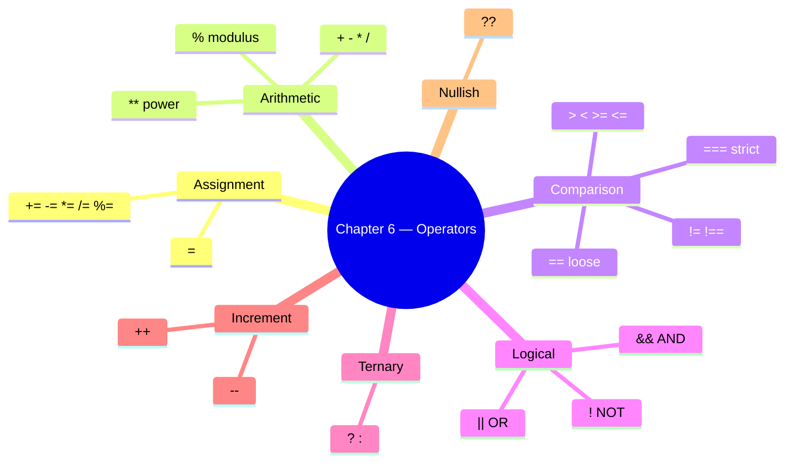

### Run them

```bash
node chapter_06_double_triple_equal/31_Arithmetic_OP.js          # → sum, sub, mul, div
node chapter_06_double_triple_equal/32_Modulus_OP.js             # → 13 % 7, odd/even via % 2
node chapter_06_double_triple_equal/36_Comparsion_Strict_loose.js # → 42 == "42" vs 42 === "42"
node chapter_06_double_triple_equal/38_Confusing_Comparsion.js   # → full == vs === reference
```

---

### 30 — Operators Overview (Assignment, Arithmetic, Modulus, Exponent, Compound)

**Concept:** Operators take 1–2 values and return a new value. Assignment writes a binding (`=`); arithmetic does math (`+ - * / % **`); compound combines both (`x += 3` = `x = x + 3`).

**Why:** Every expression in a JS program is built from operators — count loops, totals, percentages, screenshot filenames with `+`, test data math. Get the precedence wrong and the assertion is wrong.

**Q&A — why use this?**
- **Q: What's `%` actually for in tests?** A: Even/odd row striping (`i % 2 === 0`), every-Nth iteration (`i % 10 === 0` → log progress), modular bucketing of test data.
- **Q: Why prefer `x += 1` over `x = x + 1`?** A: One read of `x`, one write — same outcome, fewer keystrokes, and `+=` works on strings too (`s += " more"`).
- **Q: Is `**` the same as `Math.pow`?** A: Same numeric result. `**` is the operator (ES2016+), `Math.pow(2, 3)` is the legacy function. Prefer `**`.

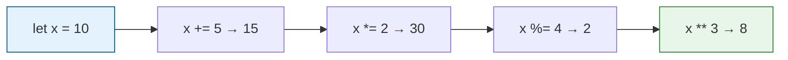

```js
// 31, 32, 33, 34 — combined
let a = 10, b = 3;
console.log(a + b);        // 13
console.log(a - b);        // 7
console.log(a * b);        // 30
console.log(a / b);        // 3.333...
console.log(a % b);        // 1   ← remainder
console.log(2 ** 10);      // 1024

// Compound assignment — same x, mutated step by step
let x = 10;
x += 10;  // 20
x -= 3;   // 17
x *= 2;   // 34
x /= 17;  // 2
x %= 2;   // 0
console.log(x);            // 0
```

---

### 35 — Comparison: `==` vs `===`

**Concept:** Comparison operators return `true`/`false`. `==` (loose) coerces types before comparing — `42 == "42"` is `true`. `===` (strict) requires same type AND same value — `42 === "42"` is `false`.

**Why:** 90% of mystery test failures around equality are caused by accidental loose equality. Strict (`===`) is the safe default; loose (`==`) is reserved for one specific trick.

**Q&A — why use this?**
- **Q: When is `==` ever the right choice?** A: One case only — `if (x == null)` matches both `null` and `undefined` in one shot. Everywhere else use `===`.
- **Q: Is `>=` strict or loose?** A: `>=`, `<=`, `>`, `<` always coerce — there is no strict version. That's why `null >= 0` is `true` even though `null == 0` is `false`.
- **Q: Why does Playwright's `expect()` not have this problem?** A: It compares with deep strict equality internally — but **your** code outside `expect()` (filters, IDs, conditions) is where `==` bites you.

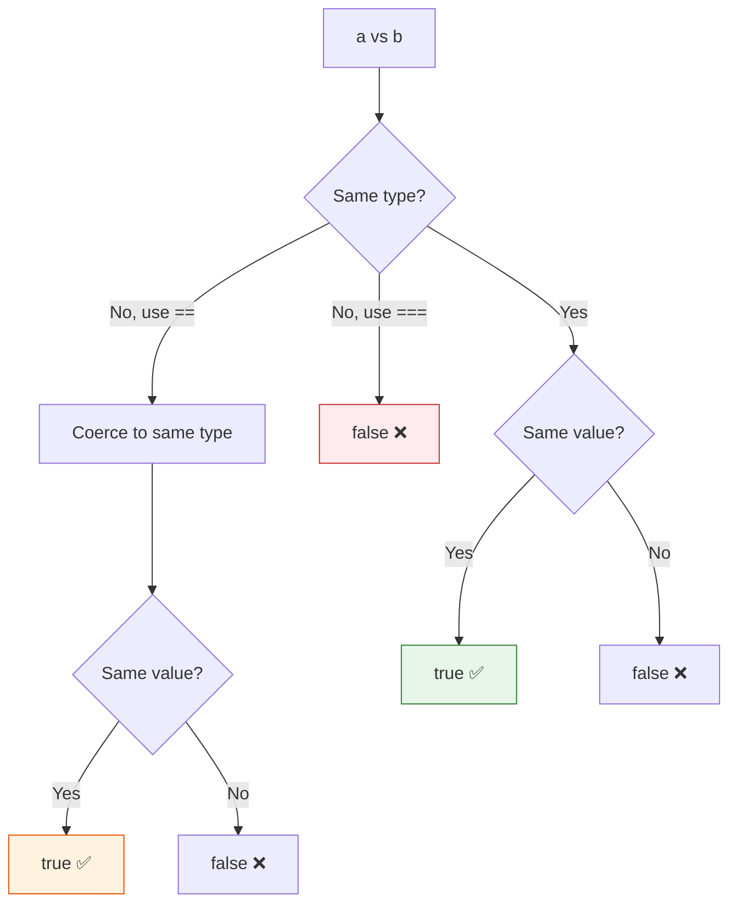

```js
// 36_Comparsion_Strict_loose.js
console.log(42 == "42");   // true   — string "42" coerced to number 42
console.log(42 === "42");  // false  — different types, strict rejects
console.log(42 == "45");   // false  — coerced, values still differ

console.log(true == 1);    // true   — true coerces to 1
console.log(false == 0);   // true   — false coerces to 0
console.log(true == "1");  // true   — both → 1

console.log(5 !== "5");    // true   — strict not-equal (type differs)
```

| Operator | Coerces? | Use when |
|:--------:|:--------:|:---------|
| `===` | ❌ | Default — always |
| `!==` | ❌ | Default — always |
| `==` | ✅ | Only `x == null` (matches null + undefined) |
| `!=` | ✅ | Only `x != null` |
| `>`, `<`, `>=`, `<=` | ✅ (no strict variant) | Numeric comparisons — guard for `null`/`NaN` first |

---

### 38 — Confusing Comparisons (the hall of fame)

**Concept:** Loose equality (`==`) walks a coercion algorithm that produces results no human would predict. `"" == 0` is `true`; `null >= 0` is `true` but `null == 0` is `false`; `NaN == NaN` is `false`; `[] == ![]` is `true`. These aren't bugs — they're spec, and they will eat your tests.

**Why:** Interviewers love these. Test runners hit them in filter conditions. Knowing the eight patterns below means you stop debugging and start fixing.

**Q&A — why use this?**
- **Q: Why is `null >= 0` true but `null == 0` false?** A: `>=` coerces `null` to `0` (relational rule). `==` has a special rule: `null` only equals `null` and `undefined`. Two different algorithms.
- **Q: How do I correctly check for `NaN`?** A: `Number.isNaN(x)` or `Object.is(x, NaN)`. **Never** `x === NaN` — it's always `false` because NaN equals nothing, not even itself.
- **Q: What's `[] == ![]` and why is it `true`?** A: `![]` → `false` → `0`. `[]` → `""` → `0`. `0 == 0` → `true`. The exclamation flips the empty array to false before coercion catches up.

```mermaid
flowchart LR
    NaN["NaN == NaN<br/>→ false"] --> Use[Use Number.isNaN(x)]
    Null["null == undefined<br/>→ true"] --> Pair[Only null/undefined pair like this]
    Empty["'' == 0<br/>'0' == 0<br/>'' == '0'  ← false"] --> Trans[Transitivity broken 🤯]
    Arr["[] == ![]<br/>→ true"] --> Trick[![] → false → 0;  [] → '' → 0]
    style NaN fill:#ffebee,stroke:#c62828
    style Empty fill:#fff3e0,stroke:#e65100
    style Arr fill:#fce4ec,stroke:#ad1457
```

```js
// 38_Confusing_Comparsion.js — the eight patterns
console.log("" == 0);             // true   — "" → 0
console.log("0" == 0);            // true   — "0" → 0
console.log("" == "0");           // false  — both strings, no coercion
console.log(null == undefined);   // true   — special rule
console.log(null == 0);           // false  — null only == undefined
console.log(null >= 0);           // true   — relational coerces null → 0
console.log(NaN === NaN);         // false  — NaN never equals anything
console.log(Number.isNaN(NaN));   // true   — correct check
console.log([] == false);         // true   — [] → "" → 0; false → 0
console.log([] == ![]);           // true   — !![] flips, both sides → 0
console.log(typeof null);         // "object" — 26-year legacy bug
```

**Takeaway:** Always reach for `===` / `!==`. Reserve `==` for one pattern only: `if (x == null)`. Use `Number.isNaN` for NaN, `Object.is` for `-0` vs `+0` edge cases.

---

### 39 — Logical & String Concatenation

**Concept:** Logical operators (`&&`, `||`, `!`) combine booleans. `&&` returns the first falsy or the last value; `||` returns the first truthy or the last value; `!` flips. `+` on a string concatenates — `"Hi" + " Dev"` → `"Hi Dev"` (use template literals for anything fancier).

**Why:** Conditional rendering of test data (`name || "Anonymous"`), guarding optional config (`opts && opts.headless`), and building dynamic log lines all live here.

**Q&A — why use this?**
- **Q: What does `user.name || "Guest"` actually return?** A: `user.name` if it's truthy (non-empty string, non-zero, etc.); otherwise the string `"Guest"`. Common default-value idiom.
- **Q: Why is `0 || "fallback"` not `0`?** A: `0` is falsy, so `||` skips it. If you want "use 0 if it's 0, fallback only if null/undefined", use `??` (nullish coalescing — file 44).
- **Q: When should I drop `+` for strings?** A: Any time more than one variable is involved. Template literals (`` `Hi ${name}` ``) win on readability and avoid type-coercion surprises (`1 + "2"` → `"12"`).

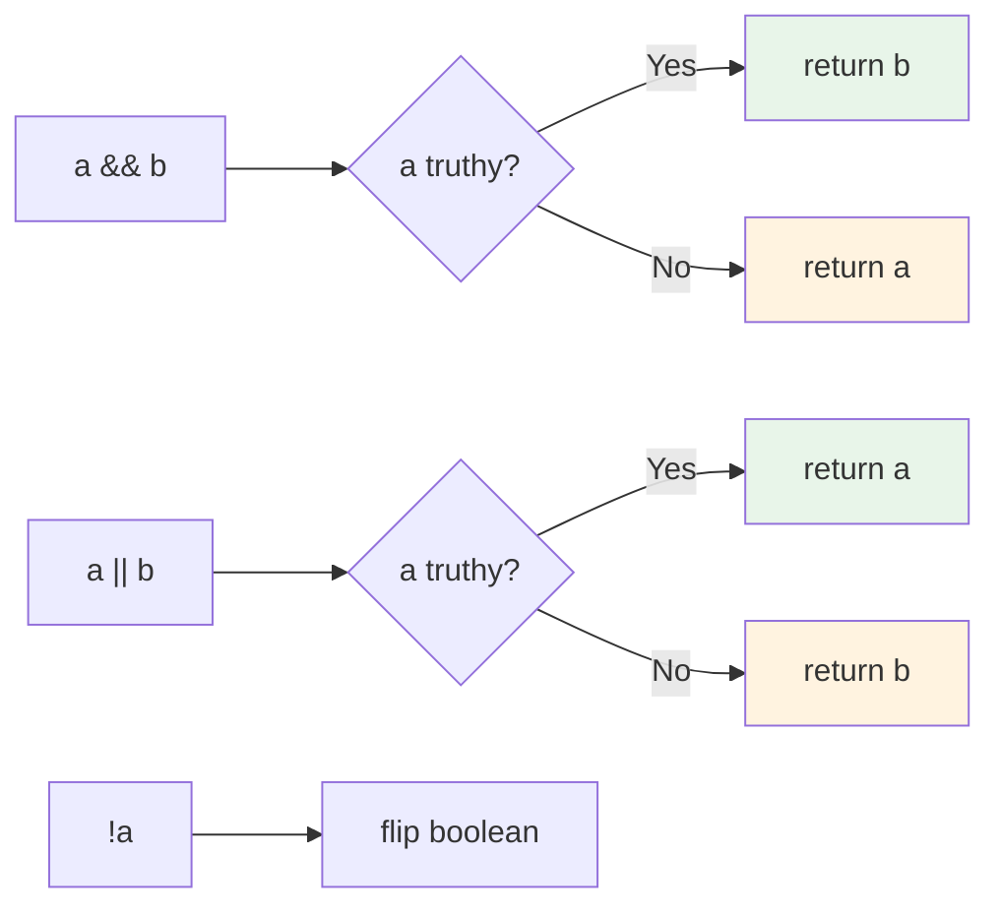

```js
// 39_Logical_Op.js + 40_String_Con_Op.js
let a = true;
let b = false;
console.log(a && b);   // false  — AND: both must be true
console.log(a || b);   // true   — OR: either is enough
console.log(!a);       // false  — NOT: flip

// short-circuit defaults
const userName = "" || "Guest";   // "Guest" — "" is falsy
const port     = 0  || 3000;      // 3000   — but use ?? if 0 is a valid value!

// string concatenation
let s = "Hi";
s += " Dev";
console.log(s);        // "Hi Dev"
```

---

### 41 — Ternary Operator

**Concept:** The ternary operator `condition ? value_if_true : value_if_false` is a compact `if/else` that returns a value. Perfect for inline assignments and simple conditionals.

**Why:** It keeps code concise when the logic is simple — assigning a default, picking between two values, or formatting output inline.

```js
// 41_Ternary_Op.js
let age = 20;
let status = age >= 18 ? "Adult" : "Minor";
console.log(status); // "Adult"

let score = 85;
let grade = score >= 90 ? "A" : score >= 80 ? "B" : score >= 70 ? "C" : "F";
console.log(grade); // "B"
```

---

### 43 — Increment & Decrement

**Concept:** `++` adds 1, `--` subtracts 1. **Pre** (`++x`) increments then returns. **Post** (`x++`) returns then increments. This distinction matters inside expressions.

**Why:** Loops (`for (let i = 0; i < n; i++)`) and array indexing rely on this behavior. Misunderstanding pre vs post causes off-by-one bugs.

```js
// 43_Incre_Decre_Op.js
let a = 5;
console.log(a++); // 5 (returns old, then a = 6)
console.log(a);   // 6

let b = 5;
console.log(++b); // 6 (increments first, then returns)
console.log(b);   // 6

// CRITICAL difference in expressions
let x = 3;
let y = x++ + 2;  // y = 3 + 2 = 5, then x = 4
let m = 3;
let n = ++m + 2;  // m = 4, then n = 4 + 2 = 6
```

---

### 44 — Nullish Coalescing (`??`)

**Concept:** `??` returns the right-hand value **only** if the left-hand is `null` or `undefined`. Unlike `||`, it does NOT treat `0`, `""`, or `false` as missing.

**Why:** In test automation, `0` is a valid timeout, `false` is a valid flag, and `""` is a valid empty string. `??` gives you "fallback only for truly missing values" without the falsy-trap of `||`.

```js
// 44_Null_Op.js
let userName = null;
let displayName = userName ?? "Guest";
console.log(displayName); // "Guest"

let userAge = 0;
let age = userAge ?? 18;
console.log(age); // 0 (0 is NOT nullish, so 0 is kept!)

let label = "";
console.log(label || "default");  // "default" (empty string is falsy)
console.log(label ?? "default");  // "" (empty string is NOT nullish)

let isActive = false;
console.log(isActive || true);   // true (false is falsy)
console.log(isActive ?? true);   // false (false is NOT nullish)
```

| Left Value | `\|\|` Result | `??` Result |
|:-----------|:------------|:-----------|
| `null` | right-hand | right-hand |
| `undefined` | right-hand | right-hand |
| `0` | right-hand | `0` ✅ |
| `""` | right-hand | `""` ✅ |
| `false` | right-hand | `false` ✅ |

---

## 📖 What's in Chapter 7 — If / Else (Available Now)

### Files

| File | Topic | What you'll learn |
|------|-------|-------------------|
| `48_IF_ESLE.js` | Basic If/Else | `if (condition) { … } else { … }` syntax |
| `49_If_elseif_else.js` | If-Else-If Ladder | Chaining multiple conditions |
| `50_REAL_IF_ELSE.js` | Real-World Examples | Practical conditional logic patterns |
| `51_API_IF_ELSE.js` | API Handling | Conditional branching on API responses |
| `52_IQ_IF_ELSE.js` | Interview Q&A | Common if/else interview questions |
| `53_IF_ELSE_real.js` | More Patterns | Additional real-world conditional examples |
| `54_IQ.js` | Quick-Fire IQ | Short conditional reasoning problems |
| `55_IE.js` | Compatibility | Browser-specific conditional checks |
| `56_IQ_EVEN_ODD.js` | Even/Odd Check | Using `%` operator inside conditions |
| `57_Grade_Calc.js` | Grade Calculator | Multi-branch if-else-if scoring logic |
| `58_LEAP_YEAR.js` | Leap Year | Nested conditions for calendar logic |

### Key Concepts

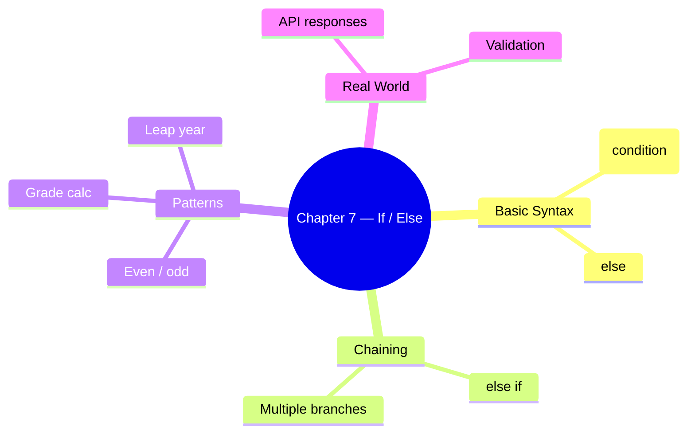

### Run them

```bash
node chapter_07_If_else/48_IF_ESLE.js           # → basic if/else voting example
node chapter_07_If_else/57_Grade_Calc.js        # → grade calculator
node chapter_07_If_else/58_LEAP_YEAR.js         # → leap year check
```

---

## 📖 What's in Chapter 8 — Switch Statement (Available Now)

### Files

| File | Topic | What you'll learn |
|------|-------|-------------------|
| `59_Switch.js` | Basic Switch | `switch (expr) { case x: … }` syntax |
| `60_No_Break.js` | Fall-Through | What happens when `break` is omitted |
| `61_Default.js` | Default Case | Handling unmatched values |
| `62_REAL_TIME_EXAMPLE.js` | Real-World Switch | Practical switch usage |
| `63_Switch_Group.js` | Case Grouping | Multiple cases sharing one block |
| `64_IQ.js` | Interview Q&A | Switch statement interview traps |
| `65_IQ2.js` | More Q&A | Additional switch questions |
| `66_IQ3.js` | Edge Cases | Unexpected switch behaviors |
| `67_IQ4.js` | Advanced Patterns | Complex switch scenarios |

### Key Concepts

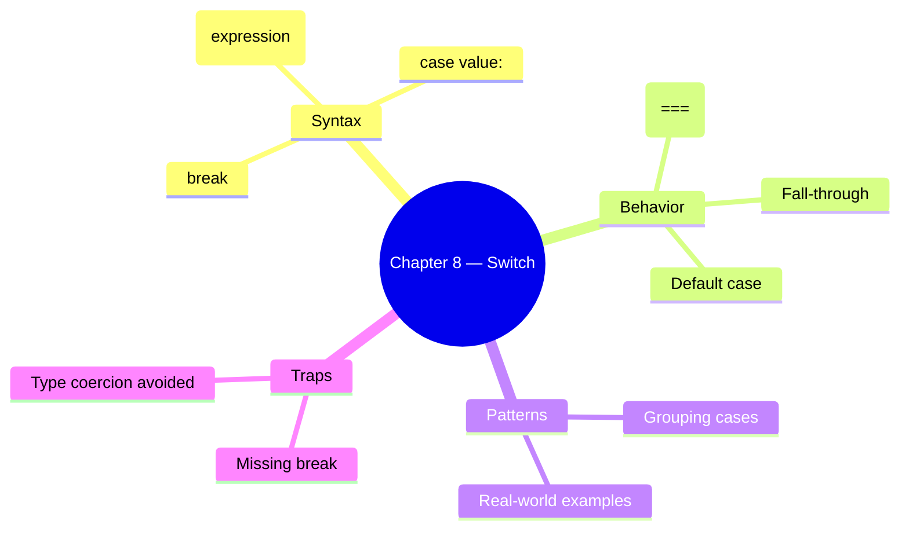

### Run them

```bash
node chapter_08_Switch_Statement/59_Switch.js              # → basic switch day example
node chapter_08_Switch_Statement/60_No_Break.js            # → fall-through behavior
node chapter_08_Switch_Statement/62_REAL_TIME_EXAMPLE.js   # → real-world switch usage
```

---

## 📖 What's in Chapter 9 — User Input (Available Now)

### Files

| File | Topic | What you'll learn |
|------|-------|-------------------|
| `68_User_Input.js` | Browser Prompt | `prompt()` for browser-based input |
| `69_Node_readline.js` | Node Readline | CLI input using `readline` module |
| `70_prompt_sync.js` | Sync Prompt | Synchronous user input patterns |
| `test.js` | Test File | Input handling experiments |

### Key Concepts

```mermaid
mindmap
  root((Chapter 9 — User Input))
    Browser
      prompt()
      alert()
    Node.js
      readline module
      createInterface
      question()
    Conversion
      String → Number
      Validation
    Patterns
      Even/odd from input
      Menu driven programs
```

### Run them

```bash
node chapter_09_UserInput/69_Node_readline.js    # → interactive CLI input
node chapter_09_UserInput/70_prompt_sync.js      # → synchronous prompt demo
```

---

## 📖 What's in Chapter 10 — Loops (Available Now)

### Files

| File | Topic | What you'll learn |
|------|-------|-------------------|
| `71_For_loop.js` | Why loops? | Repetitive `console.log` vs a loop |
| `72_For_loop.js` | Basic for loop | `for (let i = 0; i <= 5; i++)` syntax |
| `73_For_Loop2.js` | for loop variations | Different bounds and variable names |
| `74_IQ.js` | for loop IQ | Edge cases, infinite loops, conditions inside loops |
| `75_For_OF_IN_EACH.js` | while loop intro | `while` loop basics (for...of/in covered later with arrays) |
| `76_While.js` | while loop | Condition-checked-before-entry loop |
| `77_Do_While.js` | do-while | Execute at least once, then check condition |
| `78_Do_While.js` | do-while pattern | Retry / polling pattern with do-while |
| `79_IQ.js` | while IQ | Countdown and reverse iteration |
| `80_IQ.js` | do-while IQ | Edge case where body runs once despite condition |
| `81_IQ.js` | Loop IQ | More loop interview questions |
| `82_IQ.js` | Loop IQ | Advanced loop patterns |
| `Test.js` | Practice | Loop practice test file |

### Key Concepts

```mermaid
mindmap
  root((Chapter 10 — Loops))
    for loop
      Init
      Condition
      Increment
    while loop
      Check then run
    do-while loop
      Run then check
      At least once
    Patterns
      Count up
      Count down
      Retry logic
```

### Run them

```bash
node chapter_10_Loops/72_For_loop.js          # → 0 to 5
node chapter_10_Loops/76_While.js             # → while loop example
node chapter_10_Loops/77_Do_While.js         # → do-while at least once
node chapter_10_Loops/79_IQ.js              # → countdown
```

---

## 📖 What's in Chapter 11 — Arrays (Available Now)

### Files

| File | Topic | What you'll learn |
|------|-------|-------------------|
| `83_Arrays.js` | Array Basics | Empty arrays, literals, mixed types, index access |
| `84_Arrays.js` | Creating Arrays | `[]`, `new Array()`, `Array.of()`, `Array.from()` |
| `85_Access_Array.js` | Access & Modify | Index lookup, `.at()` with negative indices, reassignment |
| `86_Arrays_Adding_Remove.js` | Stack / Queue Ops | `push`, `pop`, `unshift`, `shift` |
| `87_Adding_Remove2.js` | Splice Deep Dive | `splice(start, deleteCount, ...items)` — delete, add, replace |
| `88_REAL_Example.js` | Real-World Example | Browser list manipulation with loops |
| `89_Searching.js` | Searching | `indexOf`, `lastIndexOf`, `includes`, `find`, `findIndex`, `findLast` |
| `90_Iterate.js` | Iteration | `for`, `for...of`, `forEach`, `for...in`, `.entries()` |
| `91_Transform_Array.js` | Transform | `map`, `filter`, `reduce`, `flat` |
| `92_Arrays.js` | Sorting | Default sort vs custom comparator `(a, b) => a - b` |
| `93_Array_Slicing.js` | Slice vs Splice | `slice(start, end)` (non-mutating) vs `splice` (mutating) |
| `94_Concat_array.js` | Combine & Join | `concat`, spread `[...a, ...b]`, `.join()` |
| `95_Array_Checking.js` | Validation | `Array.isArray`, `every`, `some` |

### Key Concepts

```mermaid
mindmap
  root((Chapter 11 — Arrays))
    Creation
      [] literal
      new Array()
      Array.of()
      Array.from()
    Access
      index [0]
      .at(-1)
    Mutation
      push pop
      unshift shift
      splice
    Search
      indexOf
      includes
      find findIndex
    Transform
      map
      filter
      reduce
      flat
    Sort
      default sort
      compare fn
    Combine
      concat
      spread ...
      join
    Validate
      Array.isArray
      every some
```

### Run them

```bash
node chapter_11_Arrays/83_Arrays.js              # → array basics
node chapter_11_Arrays/86_Arrays_Adding_Remove.js  # → push, pop, unshift, shift
node chapter_11_Arrays/91_Transform_Array.js       # → map, filter, reduce
node chapter_11_Arrays/92_Arrays.js               # → sort behavior
```

---

## 📖 What's in Chapter 12 — Functions (Available Now)

### Files

| File | Topic | What you'll learn |
|------|-------|-------------------|
| `96_Functions.js` | Function Basics | Define → Call workflow |
| `97_Type1_Fn_Basic_Functions.js` | Type 1 | No parameters, no return value |
| `98_Type2_Fn_With_Param_No_Return.js` | Type 2 | With parameters, no return value |
| `99_Type3_Fn_without_Param_Return_Type.js` | Type 3 | No parameters, with return value |
| `100_Type4_Fn_With_Param_With_Return.js` | Type 4 | With parameters, with return value |
| `101_Template_literal.js` | Template Literals | `` `Hello, ${name}` `` inside functions |
| `102_Fn_Expression.js` | Function Expressions | Assigning functions to variables |
| `103_Arrow_Fn.js` | Arrow Functions | ES6 `=>` syntax, implicit return |
| `104_Arrow_Fn_REAL.js` | Real-World Arrow | API status validation with arrow functions |
| `105_IIFE.js` | IIFE | Immediately Invoked Function Expressions |
| `106_Default_Param_Fn.js` | Default Parameters | Fallback values for function arguments |
| `107_IQ.js` | Interview Q&A | Function return values and patterns |
| `108_Rest_Param_Fn.js` | Rest Parameters | `...results` — collect varying arguments |
| `109_IQ.js` | Hoisting Traps | Function expressions vs declarations & TDZ |
| `110_Spead_IQ.js` | Spread + Functions | Pass arrays as individual arguments |
| `111_Scope._Fn.js` | Scope | Global vs local variable access in functions |
| `112_IQ.js` | Nested Scope | Lexical scoping and shadowing |
| `113_Closure.js` | Closure Basics | Inner function accessing outer variables |
| `114_Closure.js` | Closure Pattern | Counter with private state |
| `115_API_REAL_Closure.js` | Real-World Closure | Retry tracker with encapsulated state |
| `116_Higher_Order_Fn.js` | HOF | Functions taking or returning other functions |
| `117_Pure_Fn.js` | Pure Functions | Predictable output, no side effects |

### Key Concepts

```mermaid
mindmap
  root((Chapter 12 — Functions))
    Declaration
      function name()
    Types
      No param No return
      Param No return
      No param Return
      Param Return
    Expressions
      const fn = function()
    Arrow Functions
      () =>
      implicit return
    Advanced
      Default params
      Rest ...args
      Spread ...arr
    Scope
      Global
      Local
      Lexical
    Closure
      Inner accesses outer
      Private state
    HOF
      fn as argument
      fn as return
    Pure
      Same input → same output
      No side effects
```

### Run them

```bash
node chapter_12_Functions/97_Type1_Fn_Basic_Functions.js              # → basic greet
node chapter_12_Functions/100_Type4_Fn_With_Param_With_Return.js        # → sum with return
node chapter_12_Functions/102_Fn_Expression.js                        # → function expression
node chapter_12_Functions/103_Arrow_Fn.js                               # → arrow syntax
node chapter_12_Functions/105_IIFE.js                                   # → IIFE patterns
node chapter_12_Functions/106_Default_Param_Fn.js                     # → default parameters
node chapter_12_Functions/108_Rest_Param_Fn.js                         # → rest parameters
node chapter_12_Functions/113_Closure.js                               # → closure basics
node chapter_12_Functions/115_API_REAL_Closure.js                      # → real-world closure
node chapter_12_Functions/116_Higher_Order_Fn.js                        # → higher-order functions
node chapter_12_Functions/117_Pure_Fn.js                               # → pure vs impure
```

---

## 🔭 What's Coming Next

```mermaid
graph TD
    subgraph next["Next Up — Advanced JS"]
        N1["Ch 13: Objects"] --> N2[Ch 14: 2D Arrays]
        N2 --> N3[Ch 15: Callbacks]
        N3 --> N4[Ch 16: Promises]
    end

    style next fill:#fff3e0,stroke:#e65100
```

**Just shipped:**
- ✅ Chapter 1 — **Basics**: Hello World, env setup, hot code (files `01`–`04`)
- ✅ Chapter 2 — **JS Concepts**: Variables & console output (file `05`)
- ✅ Chapter 3 — **Identifiers & Literals**: Naming rules, comments, VS Code shortcuts (files `06`–`08`)
- ✅ Chapter 4 — **var/let/const & Hoisting**: Deep dives, TDZ, interview traps (files `09`–`21`)
- ✅ Chapter 5 — **Literals**: null/undefined, every number form, strings, template literals (files `22`–`29`)
- ✅ Chapter 6 — **Operators**: arithmetic, comparison (`==` vs `===`), confusing-comparisons reference, logical, string concat, ternary, increment/decrement, nullish coalescing (files `30`–`44`)
- ✅ Chapter 7 — **If / Else**: Basic syntax, if-else-if ladder, real-world examples, API handling, grade calculator, leap year (files `48`–`58`)
- ✅ Chapter 8 — **Switch Statement**: Basic switch, fall-through, default, case grouping, interview traps (files `59`–`67`)
- ✅ Chapter 9 — **User Input**: Browser prompt, Node readline, synchronous input, validation (files `68`–`70`)
- ✅ Chapter 10 — **Loops**: for, while, do-while, interview questions (files `71`–`82`)
- ✅ Chapter 11 — **Arrays**: Create, access, search, transform, sort, slice, concat, validate (files `83`–`95`)
- ✅ Chapter 12 — **Functions**: Declarations, expressions, arrow functions, IIFE, default/rest/spread params, scope, closures, higher-order & pure functions (files `96`–`117`)

---

## 🎯 What You'll Build (by the end)

```mermaid
graph LR
    Start([Start]) --> JS[Solid JavaScript foundation]
    JS --> TS[TypeScript fluency]
    TS --> PW[Playwright tests with POM]
    PW --> CI[CI/CD-ready test suites]
    CI --> Job([SDET-ready 🎯])

    style Start fill:#e8f5e9
    style Job fill:#ffe0b2
```

By graduation you'll have:

- ✅ A complete JavaScript + TypeScript portfolio
- ✅ Production-grade Playwright test suites with the Page Object Model
- ✅ Hands-on experience with **Playwright CLI**, **codegen**, **trace viewer**
- ✅ Interview prep — coding questions + Q&A banks

---

## 🧩 How Playwright Fits In (Big Picture)

```mermaid
flowchart TB
    subgraph App["Your App Under Test"]
        UI[Web UI]
        API[REST API]
    end

    subgraph PW["Playwright"]
        Browsers["Chromium · Firefox · WebKit"]
        Locators[Locators & Assertions]
        Fixtures[Fixtures & Config]
        Trace[Trace Viewer]
    end

    subgraph Smart["Smart Automation Layer"]
        Codegen[Codegen]
        CLI[Playwright CLI]
    end

    UI --> Browsers
    API --> Locators
    Browsers --> Locators --> Fixtures --> Trace
    Codegen --> Locators
    CLI --> Fixtures

    style PW fill:#f3e5f5,stroke:#7b1fa2
    style Smart fill:#e1f5fe,stroke:#01579b
```

---

## 🛠️ Useful Commands (You'll Use These Soon)

```bash
# JavaScript
node <file.js>                           # Run any chapter file

# TypeScript (Week 9+)
npx tsc <file.ts>                        # Compile TS → JS
npx ts-node <file.ts>                    # Run TS directly

# Playwright (Week 10+)
npm init playwright@latest               # Scaffold Playwright project
npx playwright test                      # Run all tests
npx playwright test --ui                 # Interactive UI mode
npx playwright test --debug              # Debug with inspector
npx playwright codegen <url>             # Record a test
npx playwright show-report               # Open HTML report
npx playwright show-trace <trace.zip>    # Open trace viewer
```

---

## 📘 Recommended Study Habit

| Day | Activity |
|-----|----------|
| **Class day** | Watch the live class, take notes |
| **Day +1** | Re-run every example from the chapter folder |
| **Day +2** | Solve 2–3 interview-style problems on the topic |
| **Day +3** | Build a tiny project applying the concept |
| **Weekend** | Recap the week — re-read code, ask doubts in the group |

> **Rule of thumb:** Don't move to the next chapter until you can explain the previous one out loud.

---

## 🔗 Resources

- 📚 [Playwright Docs](https://playwright.dev/docs/intro)
- 📚 [TypeScript Handbook](https://www.typescriptlang.org/docs/handbook/intro.html)
- 📚 [MDN JavaScript Guide](https://developer.mozilla.org/en-US/docs/Web/JavaScript/Guide)

---

## 🙋 Project Info

| | |
|---|---|
| **Author** | Azhar Khan |
| **Repository** | LearnPlayWrightBatch2X |
| **Stack** | JavaScript · TypeScript · Playwright · Node 18+ |

---

<div align="center">

**Happy learning, future SDETs! 🚀**

*Code with intent. Test with confidence. Automate with joy.*

</div>
