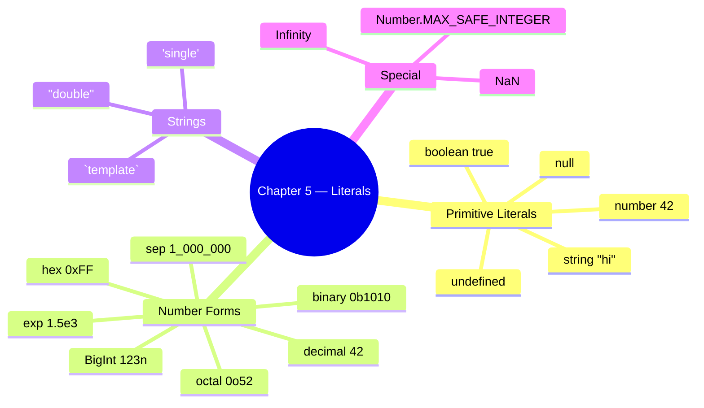
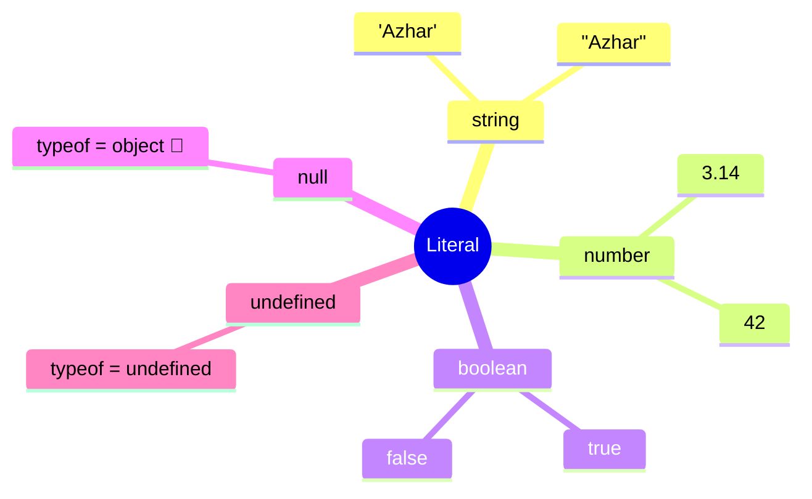
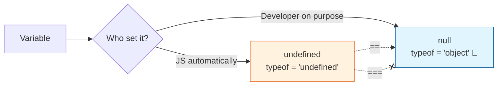
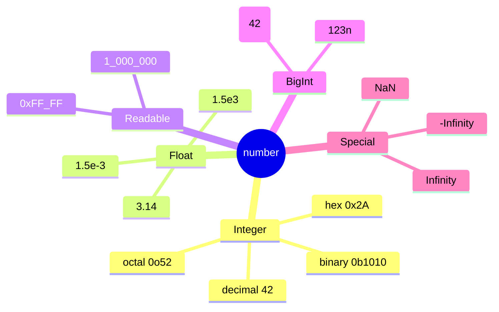

# Chapter 5 — Literals

This chapter covers primitive literals, number forms, strings, and template literals.

## Files

| File Name | Topic | Description |
|-----------|-------|-------------|
| `22_Literal.js` | Literals + `typeof` | String, number, boolean, null, undefined literals |
| `23_null_undefined.js` | null vs undefined | Who sets them, when to use which, the `typeof null === 'object'` quirk |
| `24_null.js` | Empty values | `null`, `undefined`, `""`, `0` — same role, different types |
| `25_Literal_All.js` | All literals | Whirlwind tour of every literal form |
| `26_Literal_Number_all.js` | Number literals | Decimal, binary `0b`, octal `0o`, hex `0x`, BigInt `n`, `1e6`, `1_000_000`, `NaN`, `Infinity` |
| `27_String.js` | Quotes | Single `'…'` vs double `"…'` strings (interchangeable) |
| `28_Template_Literal.js` | Backticks | `` `${var}` `` interpolation — Playwright selectors, log lines, screenshot paths |
| `29_Backtick_single_double.js` | `'` vs `"` vs `` ` `` | One-page comparison + migration from `+`-concatenation |

## Key Concepts



## Run them

```bash
node chapter_05_Literal/22_Literal.js              # → typeof for each literal
node chapter_05_Literal/23_null_undefined.js       # → null vs undefined walkthrough
node chapter_05_Literal/26_Literal_Number_all.js   # → every number literal form
node chapter_05_Literal/28_Template_Literal.js     # → backtick interpolation
```

## What is a Literal?

**Concept:** A *literal* is a value written **directly** in source code — `42`, `"hello"`, `true`, `null`. It's the raw value, not a variable referring to one.

**Why:** Every value in a JS program either comes from a literal you typed or was derived from one. Knowing the literal forms = knowing the JS type system.

**Q&A — why use this?**
- **Q: Why does `typeof null` return `"object"`?** A: 26-year-old JavaScript bug — preserved for backwards compatibility. Test against `null` with `value === null`, never `typeof`.
- **Q: Is `undefined` a literal?** A: Practically yes, but it's actually a property of the global object. Never assign `undefined` manually — let JS produce it.
- **Q: Why does `typeof` on a never-declared variable not throw?** A: `typeof` is the **only** operator that's TDZ-safe for *undeclared* identifiers. Returns `"undefined"`. (But TDZ for `let`/`const`? Still throws — see Ch 4.)



```js
// 22_Literal.js
let age = "Azhar";        // string literal
let isStudent = true;      // boolean literal
let pi = 3.14;             // number literal
let nullValue = null;      // null literal
let undefinedValue;        // implicitly undefined

console.log(typeof age);            // "string"
console.log(typeof pi);             // "number"
console.log(typeof isStudent);      // "boolean"
console.log(typeof nullValue);      // "object"   ← JS bug, kept forever
console.log(typeof undefinedValue); // "undefined"
```

## null vs undefined

**Concept:** Both mean "no value", but: `undefined` = JS set it (uninitialized, missing return); `null` = developer set it on purpose ("explicitly empty").

**Why:** Mixing them up causes 90% of "Cannot read properties of undefined" bugs in test code — knowing which to expect tells you whether the bug is in your code or the SUT.

**Q&A — why use this?**
- **Q: When should *I* assign `null`?** A: When you want to deliberately **clear** a reference (`user = null`) or signal "intentionally empty". Never reach for `undefined` — let JS produce it.
- **Q: `null == undefined` → ?** A: `true` with `==`, `false` with `===`. Always use `===` to keep them distinct in test assertions.
- **Q: Playwright API returns null — what does that mean?** A: "Element/value asked for does not exist." Returns `undefined` → "API wasn't called" or "property missing". Different bug categories.



```js
// 23_null_undefined.js
let userName;                         // JS sets it
console.log(userName);                // undefined
console.log(typeof userName);         // "undefined"

let profilePicture = null;            // developer sets it
console.log(profilePicture);          // null
console.log(typeof profilePicture);   // "object"  ← classic JS quirk

let a;
let b = null;
console.log(a == b);   // true  ← loose equality
console.log(a === b);  // false ← strict equality (different types)
```

| | `undefined` | `null` |
|:-:|:-:|:-:|
| Set by | JavaScript | Developer |
| `typeof` | `"undefined"` | `"object"` (bug) |
| Use case | "Not initialized yet" | "Cleared on purpose" |

## Number Literals (every form)

**Concept:** JS has one `number` type (IEEE-754 double) — but many ways to *write* a number: decimal, binary `0b`, octal `0o`, hex `0x`, exponential `1.5e3`, separators `1_000_000`, and `BigInt` (`123n`) for huge integers.

**Why:** Choosing the right literal form makes code self-documenting — `0xFF` says "byte mask", `0b1010_0001` says "bit flags", `1_000_000` says "one million, not ten thousand".

**Q&A — why use this?**
- **Q: When do I need BigInt?** A: When values exceed `Number.MAX_SAFE_INTEGER` (`2^53 - 1` = `9007199254740991`). Common in timestamps-with-nanoseconds, blockchain IDs, large DB IDs.
- **Q: `0 / 0` returns?** A: `NaN`. And `typeof NaN === "number"` (yes, really). Test with `Number.isNaN(x)` — **not** `x === NaN` (which is always `false`).
- **Q: Why is `0.1 + 0.2 !== 0.3`?** A: IEEE-754 float rounding. Compare with `Math.abs(a - b) < Number.EPSILON` for currency, or store cents as integers.



```js
// 26_Literal_Number_all.js
let decimal = 42;
let binary  = 0b1010;          // 10
let octal   = 0o52;            // 42
let hex     = 0x2A;            // 42
let exp     = 1.5e3;           // 1500
let million = 1_000_000;       // 1000000 (ES2021 separator)
let big     = 123456789012345678901234567890n; // BigInt

console.log(1 / 0);                          // Infinity
console.log(0 / 0);                          // NaN
console.log(typeof NaN);                     // "number"
console.log(Number.MAX_SAFE_INTEGER);        // 9007199254740991
```

## Template Literals (Backticks)

**Concept:** A string wrapped in backticks `` ` `` that supports `${expression}` interpolation and real multi-line text — no `+` concatenation, no `\n` escapes.

**Why:** Building Playwright selectors, log lines, dynamic API URLs, and screenshot paths from variables is **everywhere** in test code. Template literals are the cleanest way to do it.

**Q&A — why use this?**
- **Q: When should I prefer backticks over `'…'` / `"…"`?** A: Any string with a variable inside, any multi-line string, any string with an embedded expression. Plain text? Either is fine — be consistent.
- **Q: Can I run code inside `${…}`?** A: Yes — any JS expression: `` `${a + b}` ``, `` `${user.toUpperCase()}` ``, `` `${Date.now()}` ``. Statements (if/for) don't fit, but ternaries do.
- **Q: Do backticks work in JSON?** A: No — JSON only allows `"…"`. Use backticks to **build** the JSON string in JS, then send it.

```mermaid
flowchart LR
    A[rowIndex = 3] --> T["`[data-row=&dollar;{rowIndex}]`"]
    B[columnName = 'email'] --> T
    T --> P[page.locator(…)]
    P --> C[Click cell]
    style T fill:#fff3e0,stroke:#e65100
```

```js
// 28_Template_Literal.js — typical Playwright/test-code use
const rowIndex = 3;
const columnName = "email";
await page.locator(`[data-row="${rowIndex}"] [data-col="${columnName}"]`).click();

const testName = "Login Test";
const status = "FAILED";
const duration = 2.3;
console.log(`[${status}] ${testName} completed in ${duration}s`);

const testCase = "checkout_flow";
const timestamp = Date.now();
await page.screenshot({ path: `screenshots/${testCase}_${timestamp}.png` });
```

| Need | `'…'` / `"…"` | `` `…` `` |
|:-----|:-:|:-:|
| Plain text | ✅ | ✅ |
| `${variable}` interpolation | ❌ | ✅ |
| Multi-line without `\n` | ❌ | ✅ |
| Expression `${a + b}` | ❌ | ✅ |
| JSON-compatible | ✅ | ❌ |
