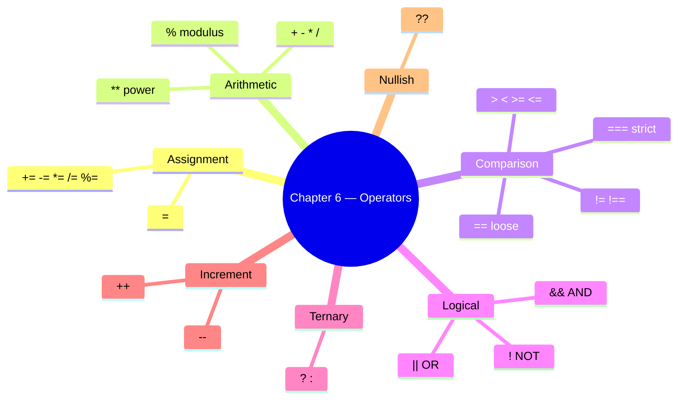
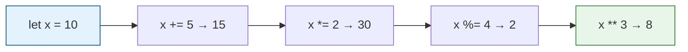
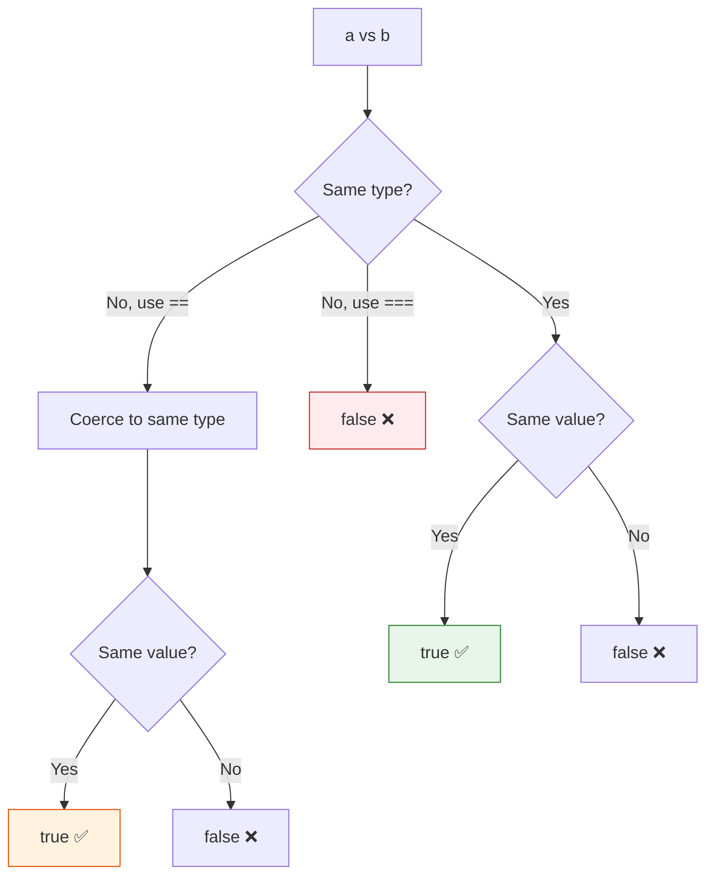
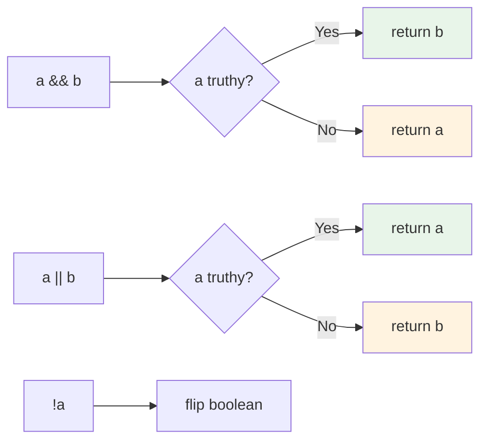

# Chapter 6 — Operators

This chapter covers assignment, arithmetic, comparison, logical, ternary, increment/decrement, and nullish coalescing operators.

## Files

| File Name | Topic | Description |
|-----------|-------|-------------|
| `30_Operator.js` | Assignment | `=` puts the right-hand value into the left-hand binding |
| `31_Arithmetic_OP.js` | Arithmetic | `+`, `-`, `*`, `/` on numbers |
| `32_Modulus_OP.js` | Modulus | `%` remainder — odd/even check (`n % 2 === 0`) |
| `33_Expo_OP.js` | Exponentiation | `**` power (`2 ** 3 === 8`) |
| `34_IQ.js` | Compound | `+=`, `-=`, `*=`, `/=`, `%=` shorthand |
| `35_Comparsion_OP.js` | Comparison | `>`, `<`, `>=`, `<=`, `==`, `===`, `!=`, `!==` → boolean |
| `36_Comparsion_Strict_loose.js` | Loose vs strict | Why `42 == "42"` is `true` but `42 === "42"` is `false` |
| `37_IQ_Loose_Strict.js` | Interview quick-fire | `0 == ""`, `0 == "0"`, `"" == "0"` — transitivity broken |
| `38_Confusing_Comparsion.js` | 🔥 == vs === | NaN, `[]`, `null`/`undefined`, `typeof null`, `[] == ![]` |
| `39_Logical_Op.js` | Logical | `&&`, `\|\|`, `!` on booleans |
| `40_String_Con_Op.js` | String concat | `+` on strings glues them (`"Hi" + " Dev"`) |
| `41_Ternary_Op.js` | Ternary | `a ? b : c` conditional operator |
| `42_Type_Op.js` | Type | `typeof` operator |
| `43_Incre_Decre_Op.js` | Increment/Decrement | `++` and `--` pre/post operators |
| `44_Null_Op.js` | Nullish | `??` nullish coalescing operator |
| `45_Post_Increment.js` | Post-Increment | Post-increment vs pre-increment deep dive |
| `46_IQ_INCREMENT_D.js` | Increment IQ | Increment/decrement interview questions |
| `47_Advance_ID_.js` | Advanced | Advanced identifier & operator patterns |

## Key Concepts



## Run them

```bash
node chapter_06_double_triple_equal/31_Arithmetic_OP.js          # → sum, sub, mul, div
node chapter_06_double_triple_equal/32_Modulus_OP.js             # → 13 % 7, odd/even via % 2
node chapter_06_double_triple_equal/36_Comparsion_Strict_loose.js # → 42 == "42" vs 42 === "42"
node chapter_06_double_triple_equal/38_Confusing_Comparsion.js   # → full == vs === reference
```

## Operators Overview (Assignment, Arithmetic, Modulus, Exponent, Compound)

**Concept:** Operators take 1–2 values and return a new value. Assignment writes a binding (`=`); arithmetic does math (`+ - * / % **`); compound combines both (`x += 3` = `x = x + 3`).

**Why:** Every expression in a JS program is built from operators — count loops, totals, percentages, screenshot filenames with `+`, test data math. Get the precedence wrong and the assertion is wrong.

**Q&A — why use this?**
- **Q: What's `%` actually for in tests?** A: Even/odd row striping (`i % 2 === 0`), every-Nth iteration (`i % 10 === 0` → log progress), modular bucketing of test data.
- **Q: Why prefer `x += 1` over `x = x + 1`?** A: One read of `x`, one write — same outcome, fewer keystrokes, and `+=` works on strings too (`s += " more"`).
- **Q: Is `**` the same as `Math.pow`?** A: Same numeric result. `**` is the operator (ES2016+), `Math.pow(2, 3)` is the legacy function. Prefer `**`.



```js
// 31, 32, 33, 34 — combined
let a = 10, b = 3;
console.log(a + b);        // 13
console.log(a - b);        // 7
console.log(a * b);        // 30
console.log(a / b);        // 3.333...
console.log(a % b);        // 1   ← remainder
console.log(2 ** 10);      // 1024

// Compound assignment — same x, mutated step by step
let x = 10;
x += 10;  // 20
x -= 3;   // 17
x *= 2;   // 34
x /= 17;  // 2
x %= 2;   // 0
console.log(x);            // 0
```

## Comparison: `==` vs `===`

**Concept:** Comparison operators return `true`/`false`. `==` (loose) coerces types before comparing — `42 == "42"` is `true`. `===` (strict) requires same type AND same value — `42 === "42"` is `false`.

**Why:** 90% of mystery test failures around equality are caused by accidental loose equality. Strict (`===`) is the safe default; loose (`==`) is reserved for one specific trick.

**Q&A — why use this?**
- **Q: When is `==` ever the right choice?** A: One case only — `if (x == null)` matches both `null` and `undefined` in one shot. Everywhere else use `===`.
- **Q: Is `>=` strict or loose?** A: `>=`, `<=`, `>`, `<` always coerce — there is no strict version. That's why `null >= 0` is `true` even though `null == 0` is `false`.
- **Q: Why does Playwright's `expect()` not have this problem?** A: It compares with deep strict equality internally — but **your** code outside `expect()` (filters, IDs, conditions) is where `==` bites you.



```js
// 36_Comparsion_Strict_loose.js
console.log(42 == "42");   // true   — string "42" coerced to number 42
console.log(42 === "42");  // false  — different types, strict rejects
console.log(42 == "45");   // false  — coerced, values still differ

console.log(true == 1);    // true   — true coerces to 1
console.log(false == 0);   // true   — false coerces to 0
console.log(true == "1");  // true   — both → 1

console.log(5 !== "5");    // true   — strict not-equal (type differs)
```

| Operator | Coerces? | Use when |
|:--------:|:--------:|:---------|
| `===` | ❌ | Default — always |
| `!==` | ❌ | Default — always |
| `==` | ✅ | Only `x == null` (matches null + undefined) |
| `!=` | ✅ | Only `x != null` |
| `>`, `<`, `>=`, `<=` | ✅ (no strict variant) | Numeric comparisons — guard for `null`/`NaN` first |

## Confusing Comparisons (the hall of fame)

**Concept:** Loose equality (`==`) walks a coercion algorithm that produces results no human would predict. `"" == 0` is `true`; `null >= 0` is `true` but `null == 0` is `false`; `NaN == NaN` is `false`; `[] == ![]` is `true`. These aren't bugs — they're spec, and they will eat your tests.

**Why:** Interviewers love these. Test runners hit them in filter conditions. Knowing the eight patterns below means you stop debugging and start fixing.

**Q&A — why use this?**
- **Q: Why is `null >= 0` true but `null == 0` false?** A: `>=` coerces `null` to `0` (relational rule). `==` has a special rule: `null` only equals `null` and `undefined`. Two different algorithms.
- **Q: How do I correctly check for `NaN`?** A: `Number.isNaN(x)` or `Object.is(x, NaN)`. **Never** `x === NaN` — it's always `false` because NaN equals nothing, not even itself.
- **Q: What's `[] == ![]` and why is it `true`?** A: `![]` → `false` → `0`. `[]` → `""` → `0`. `0 == 0` → `true`. The exclamation flips the empty array to false before coercion catches up.

```mermaid
flowchart LR
    NaN["NaN == NaN<br/>→ false"] --> Use[Use Number.isNaN(x)]
    Null["null == undefined<br/>→ true"] --> Pair[Only null/undefined pair like this]
    Empty["'' == 0<br/>'0' == 0<br/>'' == '0'  ← false"] --> Trans[Transitivity broken 🤯]
    Arr["[] == ![]<br/>→ true"] --> Trick[![] → false → 0;  [] → '' → 0]
    style NaN fill:#ffebee,stroke:#c62828
    style Empty fill:#fff3e0,stroke:#e65100
    style Arr fill:#fce4ec,stroke:#ad1457
```

```js
// 38_Confusing_Comparsion.js — the eight patterns
console.log("" == 0);             // true   — "" → 0
console.log("0" == 0);            // true   — "0" → 0
console.log("" == "0");           // false  — both strings, no coercion
console.log(null == undefined);   // true   — special rule
console.log(null == 0);           // false  — null only == undefined
console.log(null >= 0);           // true   — relational coerces null → 0
console.log(NaN === NaN);         // false  — NaN never equals anything
console.log(Number.isNaN(NaN));   // true   — correct check
console.log([] == false);         // true   — [] → "" → 0; false → 0
console.log([] == ![]);           // true   — !![] flips, both sides → 0
console.log(typeof null);         // "object" — 26-year legacy bug
```

**Takeaway:** Always reach for `===` / `!==`. Reserve `==` for one pattern only: `if (x == null)`. Use `Number.isNaN` for NaN, `Object.is` for `-0` vs `+0` edge cases.

## Logical & String Concatenation

**Concept:** Logical operators (`&&`, `||`, `!`) combine booleans. `&&` returns the first falsy or the last value; `||` returns the first truthy or the last value; `!` flips. `+` on a string concatenates — `"Hi" + " Dev"` → `"Hi Dev"` (use template literals for anything fancier).

**Why:** Conditional rendering of test data (`name || "Anonymous"`), guarding optional config (`opts && opts.headless`), and building dynamic log lines all live here.

**Q&A — why use this?**
- **Q: What does `user.name || "Guest"` actually return?** A: `user.name` if it's truthy (non-empty string, non-zero, etc.); otherwise the string `"Guest"`. Common default-value idiom.
- **Q: Why is `0 || "fallback"` not `0`?** A: `0` is falsy, so `||` skips it. If you want "use 0 if it's 0, fallback only if null/undefined", use `??` (nullish coalescing — file 44).
- **Q: When should I drop `+` for strings?** A: Any time more than one variable is involved. Template literals (`` `Hi ${name}` ``) win on readability and avoid type-coercion surprises (`1 + "2"` → `"12"`).



```js
// 39_Logical_Op.js + 40_String_Con_Op.js
let a = true;
let b = false;
console.log(a && b);   // false  — AND: both must be true
console.log(a || b);   // true   — OR: either is enough
console.log(!a);       // false  — NOT: flip

// short-circuit defaults
const userName = "" || "Guest";   // "Guest" — "" is falsy
const port     = 0  || 3000;      // 3000   — but use ?? if 0 is a valid value!

// string concatenation
let s = "Hi";
s += " Dev";
console.log(s);        // "Hi Dev"
```

## Ternary Operator

**Concept:** The ternary operator `condition ? value_if_true : value_if_false` is a compact `if/else` that returns a value. Perfect for inline assignments and simple conditionals.

**Why:** It keeps code concise when the logic is simple — assigning a default, picking between two values, or formatting output inline.

```js
// 41_Ternary_Op.js
let age = 20;
let status = age >= 18 ? "Adult" : "Minor";
console.log(status); // "Adult"

let score = 85;
let grade = score >= 90 ? "A" : score >= 80 ? "B" : score >= 70 ? "C" : "F";
console.log(grade); // "B"
```

## Increment & Decrement

**Concept:** `++` adds 1, `--` subtracts 1. **Pre** (`++x`) increments then returns. **Post** (`x++`) returns then increments. This distinction matters inside expressions.

**Why:** Loops (`for (let i = 0; i < n; i++)`) and array indexing rely on this behavior. Misunderstanding pre vs post causes off-by-one bugs.

```js
// 43_Incre_Decre_Op.js
let a = 5;
console.log(a++); // 5 (returns old, then a = 6)
console.log(a);   // 6

let b = 5;
console.log(++b); // 6 (increments first, then returns)
console.log(b);   // 6

// CRITICAL difference in expressions
let x = 3;
let y = x++ + 2;  // y = 3 + 2 = 5, then x = 4
let m = 3;
let n = ++m + 2;  // m = 4, then n = 4 + 2 = 6
```

## Nullish Coalescing (`??`)

**Concept:** `??` returns the right-hand value **only** if the left-hand is `null` or `undefined`. Unlike `||`, it does NOT treat `0`, `""`, or `false` as missing.

**Why:** In test automation, `0` is a valid timeout, `false` is a valid flag, and `""` is a valid empty string. `??` gives you "fallback only for truly missing values" without the falsy-trap of `||`.

```js
// 44_Null_Op.js
let userName = null;
let displayName = userName ?? "Guest";
console.log(displayName); // "Guest"

let userAge = 0;
let age = userAge ?? 18;
console.log(age); // 0 (0 is NOT nullish, so 0 is kept!)

let label = "";
console.log(label || "default");  // "default" (empty string is falsy)
console.log(label ?? "default");  // "" (empty string is NOT nullish)

let isActive = false;
console.log(isActive || true);   // true (false is falsy)
console.log(isActive ?? true);   // false (false is NOT nullish)
```

| Left Value | `\|\|` Result | `??` Result |
|:-----------|:------------|:-----------|
| `null` | right-hand | right-hand |
| `undefined` | right-hand | right-hand |
| `0` | right-hand | `0` ✅ |
| `""` | right-hand | `""` ✅ |
| `false` | right-hand | `false` ✅ |
