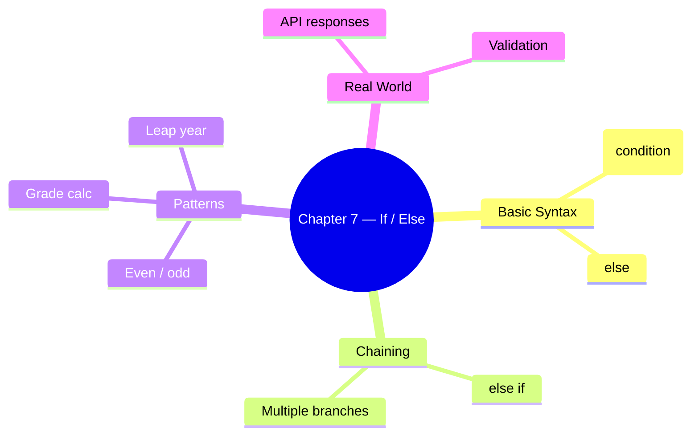

# Chapter 7 — If / Else

This chapter covers control flow decisions using `if`, `else if`, and `else`.

## Files

| File Name | Topic | Description |
|-----------|-------|-------------|
| `48_IF_ESLE.js` | Basic If/Else | `if (condition) { … } else { … }` syntax |
| `49_If_elseif_else.js` | If-Else-If Ladder | Chaining multiple conditions |
| `50_REAL_IF_ELSE.js` | Real-World Examples | Practical conditional logic patterns |
| `51_API_IF_ELSE.js` | API Handling | Conditional branching on API responses |
| `52_IQ_IF_ELSE.js` | Interview Q&A | Common if/else interview questions |
| `53_IF_ELSE_real.js` | More Patterns | Additional real-world conditional examples |
| `54_IQ.js` | Quick-Fire IQ | Short conditional reasoning problems |
| `55_IE.js` | Compatibility | Browser-specific conditional checks |
| `56_IQ_EVEN_ODD.js` | Even/Odd Check | Using `%` operator inside conditions |
| `57_Grade_Calc.js` | Grade Calculator | Multi-branch if-else-if scoring logic |
| `58_LEAP_YEAR.js` | Leap Year | Nested conditions for calendar logic |
| `If_Else_Test.js` | Practice | Practice test file |

## Key Concepts



## Run them

```bash
node chapter_07_If_else/48_IF_ESLE.js           # → basic if/else voting example
node chapter_07_If_else/57_Grade_Calc.js        # → grade calculator
node chapter_07_If_else/58_LEAP_YEAR.js         # → leap year check
```
