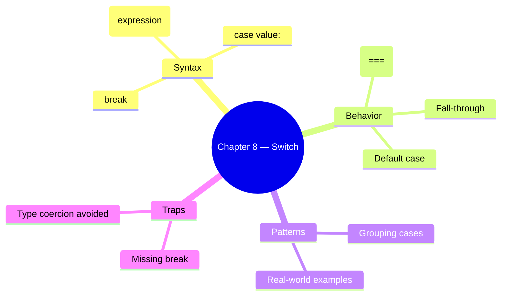

# Chapter 8 — Switch Statement

This chapter covers multi-way branching using the `switch` statement.

## Files

| File Name | Topic | Description |
|-----------|-------|-------------|
| `59_Switch.js` | Basic Switch | `switch (expr) { case x: … }` syntax |
| `60_No_Break.js` | Fall-Through | What happens when `break` is omitted |
| `61_Default.js` | Default Case | Handling unmatched values |
| `62_REAL_TIME_EXAMPLE.js` | Real-World Switch | Practical switch usage |
| `63_Switch_Group.js` | Case Grouping | Multiple cases sharing one block |
| `64_IQ.js` | Interview Q&A | Switch statement interview traps |
| `65_IQ2.js` | More Q&A | Additional switch questions |
| `66_IQ3.js` | Edge Cases | Unexpected switch behaviors |
| `67_IQ4.js` | Advanced Patterns | Complex switch scenarios |

## Key Concepts



## Run them

```bash
node chapter_08_Switch_Statement/59_Switch.js              # → basic switch day example
node chapter_08_Switch_Statement/60_No_Break.js            # → fall-through behavior
node chapter_08_Switch_Statement/62_REAL_TIME_EXAMPLE.js   # → real-world switch usage
```
