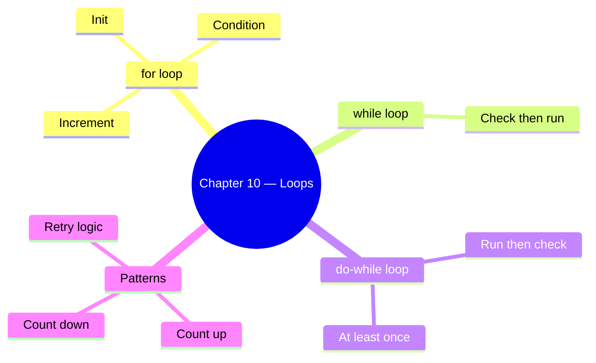

# Chapter 10 — Loops

This chapter covers `for`, `while`, and `do-while` loops for repeating code.

## Files

| File Name | Topic | Description |
|-----------|-------|-------------|
| `71_For_loop.js` | Why loops? | Repetitive `console.log` vs a loop |
| `72_For_loop.js` | Basic for loop | `for (let i = 0; i <= 5; i++)` syntax |
| `73_For_Loop2.js` | for loop variations | Different bounds and variable names |
| `74_IQ.js` | for loop IQ | Edge cases, infinite loops, conditions inside loops |
| `75_For_OF_IN_EACH.js` | while loop intro | `while` loop basics (for...of/in covered later with arrays) |
| `76_While.js` | while loop | Condition-checked-before-entry loop |
| `77_Do_While.js` | do-while | Execute at least once, then check condition |
| `78_Do_While.js` | do-while pattern | Retry / polling pattern with do-while |
| `79_IQ.js` | while IQ | Countdown and reverse iteration |
| `80_IQ.js` | do-while IQ | Edge case where body runs once despite condition |
| `81_IQ.js` | Loop IQ | More loop interview questions |
| `82_IQ.js` | Loop IQ | Advanced loop patterns |
| `Test.js` | Practice | Loop practice test file |

## Key Concepts



## Run them

```bash
node chapter_10_Loops/72_For_loop.js          # → 0 to 5
node chapter_10_Loops/76_While.js             # → while loop example
node chapter_10_Loops/77_Do_While.js         # → do-while at least once
node chapter_10_Loops/79_IQ.js              # → countdown
```
