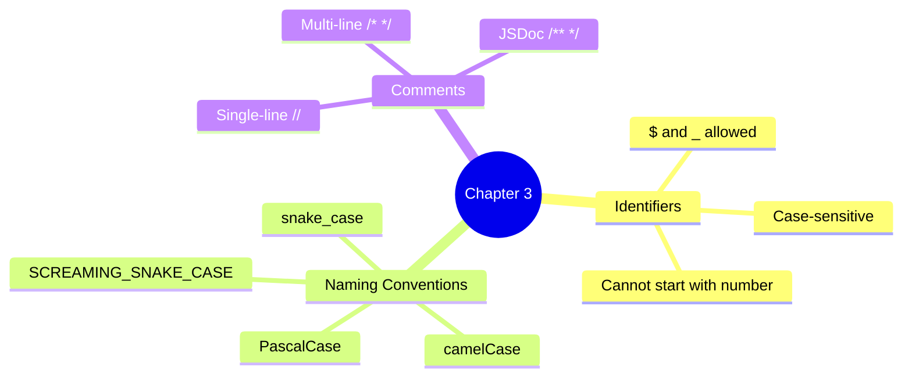

# Chapter 3 — Identifiers & Literals

This chapter covers valid identifier names, naming conventions, comments, and VS Code shortcuts.

## Files

| File Name | Topic | Description |
|-----------|-------|-------------|
| `06_Identifier_Rules.js` | Identifier Rules | Valid names (`$`, `_`, camelCase) |
| `07_Identifier_Part2.js` | Naming Conventions | camelCase, PascalCase, snake_case |
| `08_Comments.js` | Comments | Single-line, multi-line & JSDoc style |
| `js_Identifier_rules.js` | Reference | Quick identifier rules cheat-sheet |
| `VS_Code_KeyBoard_Mac_Short_cuts.md` | Shortcuts | VS Code keyboard shortcuts for macOS |
| `VS_Code_KeyBoard_Windows_Short_cuts.md` | Shortcuts | VS Code keyboard shortcuts for Windows |
| `VS_Code_Shortcuts_Guide.md` | Shortcuts | VS Code shortcuts guide |
| `Identifier_Keyword_Literal_Guide.md` | Reference | Identifier, keyword, and literal guide |

## Key Concepts



## Run them

```bash
node chapter_3_Identifier_Literals/06_Identifier_Rules.js  # → identifier rules
node chapter_3_Identifier_Literals/07_Identifier_Part2.js  # → naming conventions
node chapter_3_Identifier_Literals/08_Comments.js          # → comments demo
```
