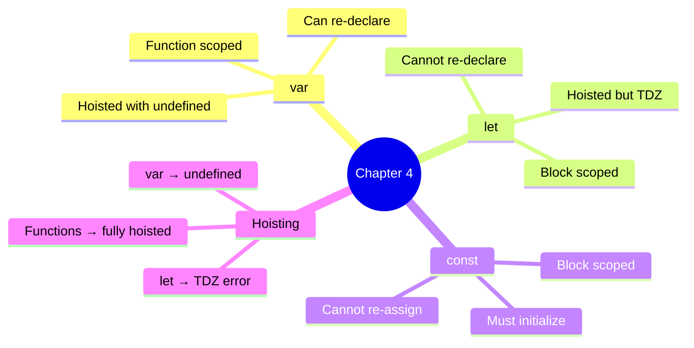
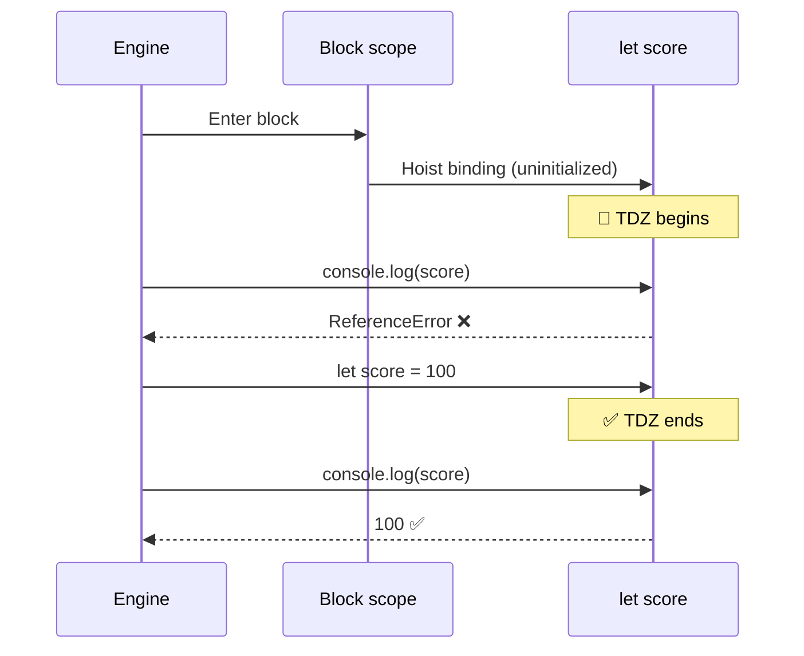

# Chapter 4 — var / let / const & Hoisting

This chapter covers variable declarations (`var`, `let`, `const`), hoisting, and the Temporal Dead Zone (TDZ).

## Files

| File Name | Topic | Description |
|-----------|-------|-------------|
| `09_var_let_const.js` | var, let, const | Declaration, re-declaration, reassignment |
| `10_functions.js` | Functions | Declaring and calling functions |
| `11_var_explained.js` | var Deep Dive | How `var` works in loops & functions |
| `12_let_peopelove.js` | let Deep Dive | Block-scoped `let` behavior |
| `13_const_explained.js` | const Deep Dive | Immutable bindings with `const` |
| `14_functionscope.js` | Function Scope | `var` scoped to functions |
| `15_letscope.js` | Block Scope | `let` scoped to blocks `{}` |
| `16_hoisting.js` | Hoisting | Variable hoisting & `undefined` |
| `17_hostingfunction.js` | Function Hoisting | How function declarations are hoisted |
| `18_let_hoisting.js` | let TDZ | Temporal Dead Zone — why `let` errors before declaration |
| `19_let_hoisting_block.js` | Block TDZ | Inner-block `let` does **not** inherit outer value |
| `20_let_const.js` | const Hoisting | `const` is hoisted too — same TDZ rules apply |
| `21_Jr_QA.js` | Interview Q&A | Classic TDZ trap with `const` (junior SDET quiz) |
| `practice.js` | Practice | Extra practice file |

## Key Concepts



## Run them

```bash
node chapter_4_JavaScript_Concepts/09_var_let_const.js  # → var, let, const behavior
node chapter_4_JavaScript_Concepts/16_hoisting.js       # → see hoisting in action
node chapter_4_JavaScript_Concepts/18_let_hoisting.js   # → throws TDZ ReferenceError
node chapter_4_JavaScript_Concepts/21_Jr_QA.js          # → interview-style TDZ trap
```

## Temporal Dead Zone (TDZ)

**Concept:** TDZ is the window between when a `let`/`const` is hoisted to the top of its block and when its declaration line is actually reached. Inside that window any read or write throws `ReferenceError: Cannot access 'x' before initialization`.

**Why:** Catches use-before-declare bugs at the source — unlike `var`, which silently returns `undefined` and hides the bug until runtime.

**Q&A — why use this?**
- **Q: Are `let` and `const` really hoisted?** A: Yes — but to a "not yet usable" state. The binding exists; the value does not. That gap is the TDZ.
- **Q: How is this different from `var`?** A: `var` is hoisted **and** initialized to `undefined` immediately. `let`/`const` are hoisted but uninitialized — touching them = ReferenceError.
- **Q: Why does the interview question with `const c` throw?** A: The `console.log(c)` runs **inside** the TDZ of `const c = "Azhar"`. Hoisting is not "no declaration"; it's "declaration parked, value not yet set".



```js
// 18_let_hoisting.js — TDZ in action
console.log(score); // ❌ ReferenceError: Cannot access 'score' before initialization
let score = 100;

{
    // ---- TDZ for inner "score" starts ----
    // console.log(score);  // ❌ ReferenceError
    // typeof score;        // ❌ ReferenceError (!! typeof normally never throws)
    let score = 100;        // ✅ TDZ ends here
    console.log(score);     // 100
}
```

| Trap | `var` | `let` / `const` |
|:-----|:-----:|:---------------:|
| Read before declaration | `undefined` | **ReferenceError** |
| Re-declare in same scope | ✅ allowed | ❌ SyntaxError |
| Scope | Function | Block `{}` |
| Hoisted? | ✅ + initialized | ✅ but in TDZ |
